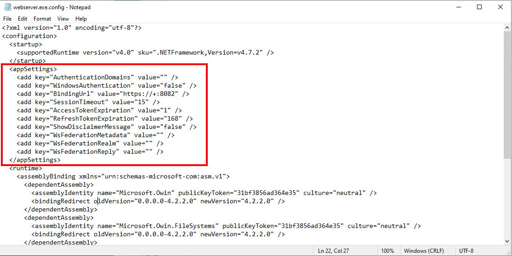
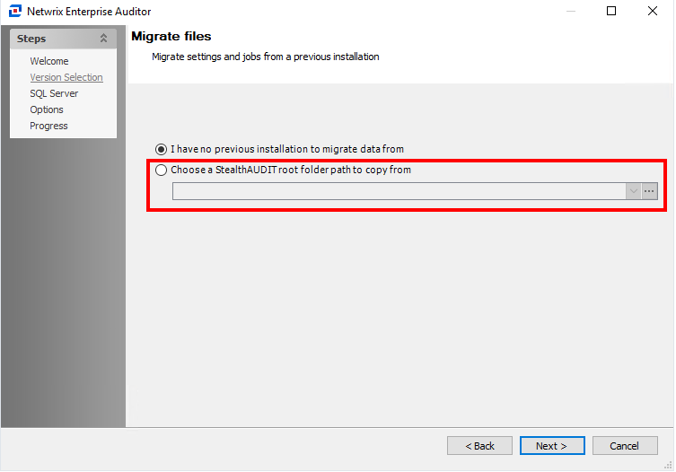
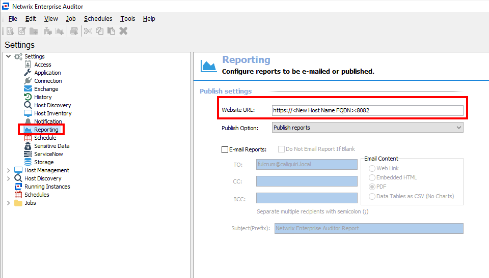

# Console Migration Workflow: Step 3—Rebuild the Console

> **NOTE:** Return to the main workflow page via this link: [Console Migration Workflow](/docs/accessanalyzer/console-migration-workflow.md).
>
> Return to the previous section via this link: [Console Migration Workflow: Step 2—Prepare the Database](/docs/accessanalyzer/console-migration-workflow-step-2-prepare-the-database).
>
> Proceed to the next section via this link: [Console Migration Workflow: Step 4—Validating the Migration](/docs/accessanalyzer/console-migration-workflow-step-4-validate-the-migration)

## Overview

This article lists the steps for rebuilding the Netwrix Access Analyzer console during the Access Analyzer Migration.

## Installing the Access Analyzer Console

Follow the steps below to rebuild the Access Analyzer Console on the new server. Before installation, ensure that the `NAA_Migration` folder with the `StealthAUDIT.lic` license file is stored locally on the new Access Analyzer Console so it can be referenced during the installation process.

1. Confirm that the prerequisites have been met on the Access Analyzer Console Server.
   - Netwrix Help Center | Netwrix Access Analyzer 12.0 System Requirements: /docs/accessanalyzer/12.0/requirements
2. Install the Access Analyzer application, as well as the Access Information Center (AIC) application if the server will host both.

   > IMPORTANT: Do **NOT** start the Access Analyzer or AIC applications at this time.

## Restoring the Backup Files

1. After the initial installation of Access Analyzer and AIC, restore the following contents of the `NAA_Migration` folder:

   | File/Folder | Purpose |
   |-------------|---------|
   | `%SAInstallDir%\Jobs` | Contains the jobs from the SA jobs tree |
   | `%SAInstallDir%\StealthAUDIT.lic` | The license key for the Netwrix Auditor product |
   | `%SAInstallDir%\Reports` | Ensures that you do not need to republish all reports |
   | `%SAInstallDir%\CLU` | Contains any Command Line Utility parameters |
   | `%SAInstallDir%\ODBCProfiles\Custom` | Contains any custom ODBC connect strings for SQL |
   | `%SAInstallDir%\SADatabase\Views` | Contains the host list definitions |
   | `%SAInstallDir%\SecurityMap` | Contains all of the connection profiles |
   | `%SAInstallDir%\GlobalOptions.xml` | Contains the Global Options |
   | `%SAInstallDir%\SPProfiles.XML` | Contains the Storage Profiles |
   | `%SAInstallDir%\rba.conf` | Contains the Role-Based Access Configuration |
   | `%SAInstallDir%\rba-reporting.conf` | Published Reports role-based access |
   | `%SAInstallDir%\DC\patternsdef.xml` | Configured SDD Criteria |
   | `%SAInstallDir%\DC\mypatternsdef.xml` | Custom SDD Criteria |
   | `%SAInstallDir%\FSAA` | Contains short-term data related to file server collections |
   | `C:\Windows\System32\Tasks` | Specifically task names beginning with `SA*.job` |

2. After you have copied the Reports folder from the old server to the new one, change the report hostname path to show it in the web server:  
   ` %SAInstallDir%Reports\v3\<NewServerHostName>`

3. After you have copied the Scheduled Tasks to `C:\Windows\System32\Tasks`, run the script below from an Admin PowerShell to register them:

```powershell
$InstallPath=Get-ItemPropertyValue -Path HKLM:\SOFTWARE\WOW6432Node\STEALTHbits\StealthAUDIT -Name 'InstallPath' 
$NewServerInstallerPath =$InstallPath+'StealthAuditStart.exe'  
$ScheduledTaskFilePath="C:\Windows\System32\Tasks" 

Get-ChildItem -Path $ScheduledTaskFilePath -Filter SA*.job | Foreach-Object { 

$content = [xml] (Get-Content $_.FullName) 
$oldServerInstallerPath= $content.Task.Actions.Exec.Command 

If($oldServerInstallerPath -ne $NewServerInstallerPath) 
{ 
 $Content.Task.Actions.Exec.Command = $NewServerInstallerPath 
 $Content.Save($_.FullName) 
} 

$taskName = ([System.IO.Path]::GetFileNameWithoutExtension($_.FullName)) 
$TaskExist=Get-ScheduledTask -TaskName $taskName -ErrorAction SilentlyContinue  

if (!$TaskExist)  
{ 
$UserID=$Content.Task.Principals.Principal.UserId 
Register-ScheduledTask -Xml (get-content $_.FullName | out-string) -TaskName $taskName -User $UserID -Force 
}   
 } 
```

4. Open `\NAA_Migration\NAA\Web\webserver.exe.config` and copy the content between `<appSettings></appSettings>` and paste it in place of the `<appSettings></appSettings>` block in `%SAInstallDir%Web\webserver.exe.config`.

   

   NOTE: Open the destination `webserver.exe.config` as an administrator by following these steps:

   1. Search **Notepad** in Start menu.
   2. Right-click > **Run as administrator**.
   3. In Notepad, click **File** > **Open %SAInstallDir%Web\webserver.exe.config**.

5. Open `\NAA_Migration\AIC\AccessInformationCenter.Service.exe.config` and copy the content between `<appSettings></appSettings>` and paste it in place of the `<appSettings></appSettings>` block in `\Program Files\STEALTHbits\Access Information Center\AccessInformationCenter.Service.exe.Config`.

   NOTE: Open the destination `AccessInformationCenter.Service.exe.config` as an administrator by following the steps below:

   1. Search **Notepad** in Start menu.
   2. Right-click > **Run as administrator**.
   3. In Notepad, click **File** > **Open** … `\Program Files\STEALTHbits\Access Information Center\AccessInformationCenter.Service.exe.Config`.

6. Open the Netwrix Access Analyzer application and follow through the Access Analyzer Configuration Wizard, selecting **Choose a StealthAUDIT root folder path to copy from** if prompted.

   

   1. See the following for more information on the Netwrix Access Analyzer Configuration Wizard: Access Analyzer Initial Configuration — /docs/accessanalyzer/12.0/install/application

7. After completing the Configuration Wizard, the Access Analyzer Application should open automatically.

8. In the Access Analyzer Console, navigate to **Settings** > **Reporting**, and set the **Website URL** to contain the new console server's name.

   

9. If using Windows Authentication to connect Access Analyzer to its database (click **Settings** > **Storage**), open `services.msc` and set the **Netwrix Access Analyzer Web Server** service to log on as a **Windows** service account with appropriate permissions on the Access Analyzer database.

## Additional Considerations

If using any of the below, please recreate the certificate for the new NAA Console Server:

- Netwrix Access Analyzer for SharePoint Online: /docs/accessanalyzer/12.0/configuration/sharepointonline
- Netwrix Access Analyzer for Exchange Online: /docs/accessanalyzer/12.0/configuration/exchangeonline
- Secured Published Reports Site (HTTPS): /docs/accessanalyzer/12.0/install/application/reports
- Secured AIC Site (HTTPS): /docs/accessanalyzer/12.0/access/informationcenter/installation

## Related Links

- Console Migration Workflow: /docs/accessanalyzer/console-migration-workflow
- Console Migration Workflow: Step 2—Prepare the Database: /docs/accessanalyzer/console-migration-workflow-step-2-prepare-the-database
- Console Migration Workflow: Step 4—Validating the Migration: /docs/accessanalyzer/console-migration-workflow-step-4-validate-the-migration
- Netwrix Help Center | Netwrix Access Analyzer 12.0 System Requirements: /docs/accessanalyzer/12.0/requirements
- Access Analyzer Initial Configuration: /docs/accessanalyzer/12.0/install/application
- Netwrix Access Analyzer for SharePoint Online: /docs/accessanalyzer/12.0/configuration/sharepointonline
- Netwrix Access Analyzer for Exchange Online: /docs/accessanalyzer/12.0/configuration/exchangeonline
- Secured Published Reports Site (HTTPS): /docs/accessanalyzer/12.0/install/application/reports
- Secured AIC Site (HTTPS): /docs/accessanalyzer/12.0/access/informationcenter/installation
