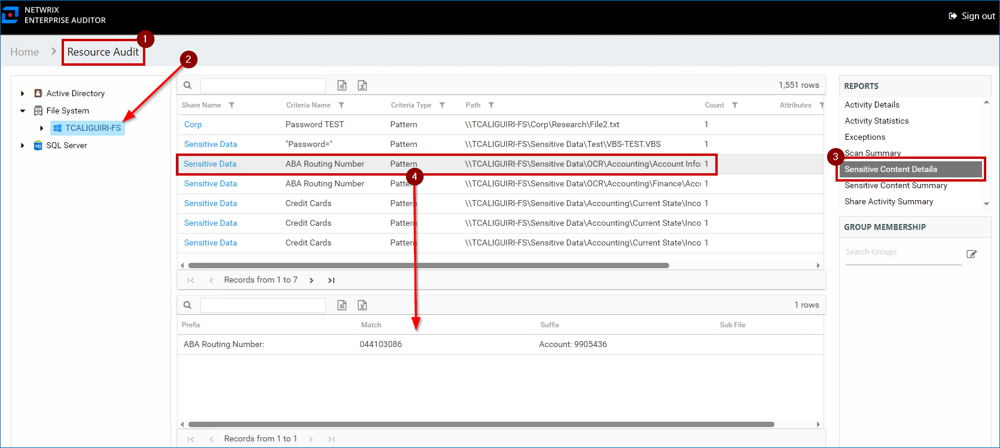
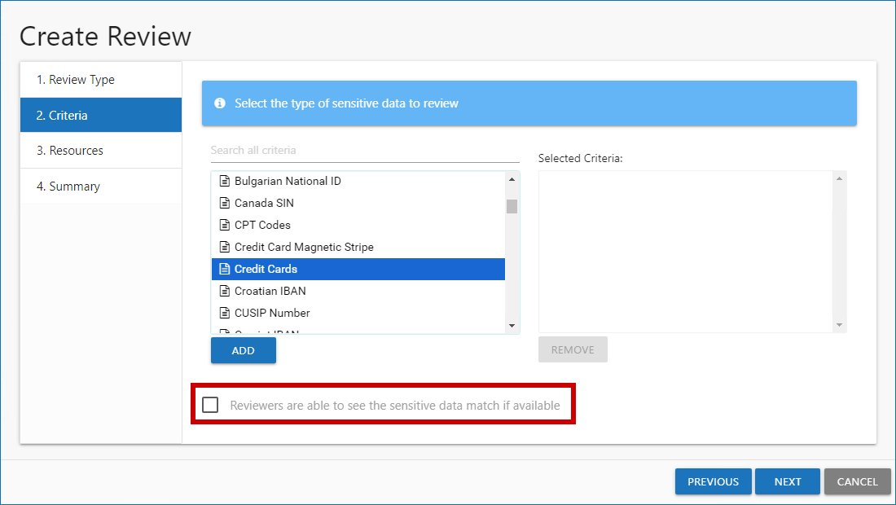

# How to View Stored Sensitive Data Discovery (SDD) Matches

## Question

How can you view stored Sensitive Data Discovery (SDD) matches in FileSystem Sensitive Data (SEEK)?

> **NOTE:** To be able to view populated **Sensitive Content Details** reports, enable the **Store discovered sensitive data** option for the corresponding collector in **Sensitive Data Settings**. For additional information on the initial SDD setup in specific collectors, refer to the following documentation section: Administration − Data Collectors · v11.6.

## Answer

> **NOTE:** The Sensitive Data Discovery criteria searches in Access Information Center can be run exclusively by users with either the **Security Team** or **Console Administrator** role. Users with the **Reader** role will receive blank reports.

You can view stored SDD matches using one of the following methods.

### Access Information Center − Sensitive Content Reports

1. Select the server.
2. In the right **Reports** pane, select **Sensitive Content Details**.

For additional information, refer to: Resource Audit Overview − Sensitive Content Reports · v11.6  
(/docs/accessanalyzer/11.6/access/resource-audit-guide)

### Access Information Center − Resource Review

1. Assign Resource Owners. Refer to: Resource Owners Overview · v11.6  
   (/docs/accessanalyzer/11.6/access/informationcenter/resourceowners)
2. Create a Sensitive Data Resource review. Refer to: Resource Ownership with the Access Information Center − Perform a Sensitive Data Review · v11.6  
   (/docs/accessanalyzer/11.6/access/informationcenter/resourcereviews/review)

> **IMPORTANT:** Check the **Reviewers are able to see the sensitive data match if available** checkbox for the review to contain sensitive data matches.

### Netwrix Access Analyzer − Custom report

1. Create a new report under the **FileSystem** > **7.Sensitive Data** > **FS_DLPResults** Job.
   > **NOTE:** For additional information on custom reports, refer to: Reporting − Report Configuration Wizard · v11.6  
   > (/docs/auditor/10.8/enterpriseauditor/admin-guide/report/wizard)
2. In the **Authoring** page of the Report Configuration Wizard, specify the report name and title.
3. In **E-mail** and **Publish Security** pages, specify the recipients and intended audience for the report − refer to:
   - Report Configuration Wizard − E-mail Page · v11.6  
     (/docs/auditor/10.8/enterpriseauditor/admin-guide/report/wizard)
   - Report Configuration Wizard − Publish Security Page · v11.6  
     (/docs/auditor/10.8/enterpriseauditor/admin-guide/report/wizard)
4. In the **Layout** page, select the single block option and set the **Select the number of rows** counter to **1 row**.
5. In the **Widgets** page, configure the report layout − refer to: Report Configuration Wizard − Widgets Page · v11.6  
   (/docs/auditor/10.8/enterpriseauditor/admin-guide/report/wizard)
6. In the **DataSource Options** window, uncheck the **Current Job Only** checkbox and select the `SA_FSDLP_MatchHitsView` table.
   > **NOTE:** You can omit the data columns included in the report via **Column Chooser**.
7. After saving the report, generate it either by clicking the three-dot icon (the **More** button) > **Generate**, or by running the `FS_DLPResults` Job.

## Related articles

- Administration − Data Collectors · v11.6
- Resource Audit Overview − Sensitive Content Reports · v11.6
- Resource Owners Overview · v11.6
- Resource Ownership with the Access Information Center − Perform a Sensitive Data Review · v11.6
- File System Solution − 7.Sensitive Data > FS_DLPResults Job · v11.6
- Reporting − Report Configuration Wizard · v11.6
- Report Configuration Wizard − E-mail Page · v11.6
- Report Configuration Wizard − Publish Security Page · v11.6
- Report Configuration Wizard − Widgets Page · v11.6
