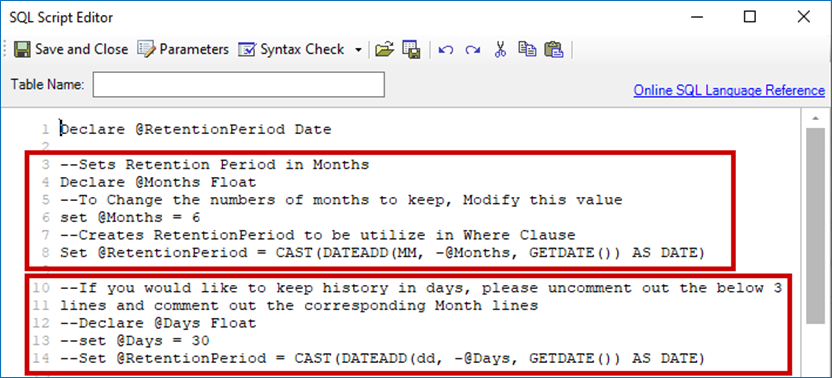

# Support for Historical Data Retention in Access Analyzer Jobs

## Overview

Depending on the needs, the historical data retention option can be set up in Netwrix Access Analyzer to allow an in-depth analysis of historical data in your environment. This article lists solutions and Jobs that do and do not support data retention.

## Supported solutions

> **IMPORTANT:** Enabling the data retention option in unsupported solutions may cause issues related to data analysis and reporting.

- Exchange Solution

  1. **HUB Metrics Job Group** − **0.Collection Job Group**

     The default History Retention setting is set to 6 months for both `EX_MetricsCollection` and `EX_MetricsDetail` Jobs. To adjust it, modify the **SET HISTORY RETENTION** analysis task for the corresponding job. This can be configured for months or days.

     

  2. **CAS Metrics Job Group** − **ActiveSync Job Group** − **EX_ActiveSync Job**

     The default History Retention setting is set to 6 months. To adjust it, modify the **SET HISTORY RETENTION** analysis task for the job.

  3. **CAS Metrics Job Group** − **Outlook Web Access Job Group** − **EX_OWATraffic Job**

     The default History Retention setting is set to 6 months. To adjust it, modify the **SET HISTORY RETENTION** analysis task for the job.

  4. **Databases Job Group** − **EX_DBSizing Job**

     The default History Retention setting is set to 6 months. To adjust it, modify the **SET HISTORY RETENTION** analysis task for the job.

  5. **Mailboxes Job Group** − **Logons Job Group** − **EX_MailboxLogons Job**

     The default History Retention setting is set to 6 months. To adjust it, modify the **SET HISTORY RETENTION** analysis task for the job.

  6. **Mailboxes Job Group** − **Sizing Job Group** − **EX_MailboxSizes Job**

     The default History Retention setting is set to 6 months. To adjust it, modify the **SET HISTORY RETENTION** analysis task for the job.

  7. **Public Folders Job Group** − **Growth and Size Job Group** − **PF_FolderSize Job**

     The default History Retention setting is set to 6 months. To adjust it, modify the **SET HISTORY RETENTION** analysis task for the job.

  8. **Exchange Online Job Group** > **Mailflow Job Group** > **EX_Mailflow Job**

     The default History Retention setting is set to 6 months. To adjust it, modify the **SET HISTORY RETENTION** analysis task for the job.

- File System Solution

  > **IMPORTANT:** To adjust the retention period for the File System Activity (FSAC) historical data, use the **Activity Settings** page of the 1-FSAC System Scan Job. Refer to the following article for additional information: /docs/auditor/10.8/addon/solutions/filesystem/collection

  - **4.Content Job Group**

    The historical data retention is optional for Jobs in the group. Turning the **History** option on or off will not affect analysis tasks or reporting. To adjust the retention settings, right-click Job > select **Properties** > select the **History** tab.

  - **6.Probable Owner Job Group**

    The historical data retention is optional for Jobs in the group. Turning the **History** option on or off will not affect analysis tasks or reporting. To adjust the retention settings, right-click Job > select **Properties** > select the **History** tab.

- SharePoint Solution

  To adjust the retention period for the SharePoint Activity historical data, use the **Activity Date Scope** page of the SPAC System Scan. Refer to the following article for additional information: /docs/auditor/10.8/addon/admin-guide/datacollector/spaa

- Databases Solutions

  To adjust the retention period for the Database Activity historical data, use the **Options** page of the corresponding ActivityScan Job. This option is currently available only in SQL and AzureSQL instances. Refer to the following articles for additional information:
  - /docs/auditor/10.8/addon/solutions/databases/sql/collection
  - /docs/auditor/10.8/addon/solutions/databases/azuresql/collection

## Solutions not yet supported

> **IMPORTANT:** Enabling the data retention option in unsupported solutions may cause issues related to data analysis and reporting.

The following solutions do not yet support any historical data retention:

- Inventories (Active Directory, Entra ID, NIS).
- Active Directory.
- Active Directory Permissions Analyzer.
- AnyID Connectors.
- AWS.
- Box.
- Dropbox.
- Entra ID.
- Unix.

## Related articles

- /docs/auditor/10.8/addon/solutions/filesystem/collection — 0.Collection Job Group − 1-FSAC System Scans Job · v11.6
- /docs/auditor/10.8/addon/admin-guide/datacollector/spaa — SharePointAccess Data Collector − Activity Date Scope · v11.6
- /docs/auditor/10.8/addon/solutions/databases/sql/collection — 0.Collection > SQL Job Group − 3-SQL_ActivityScan Job · v11.6
- /docs/auditor/10.8/addon/solutions/databases/azuresql/collection — 0.Collection > Azure SQL Job Group − 3-AzureSQL_ActivityScan Job · v11.6
