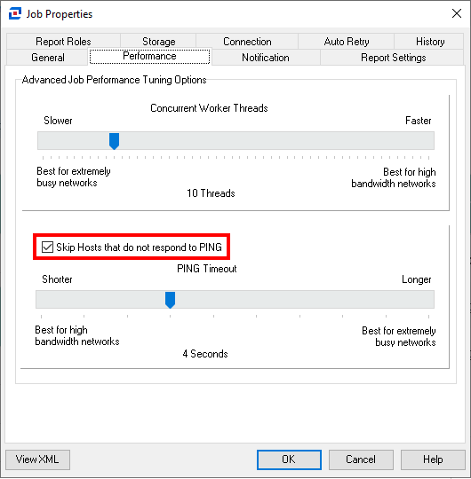
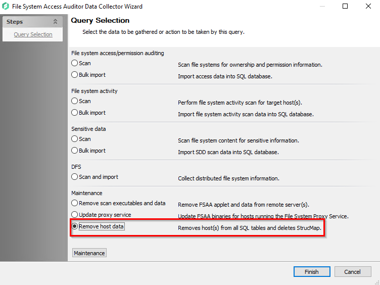
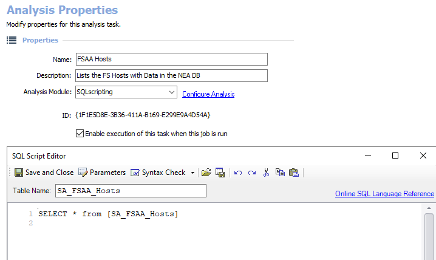

# How to Drop File System Data from Netwrix Access Analyzer

## Overview

A file server has been decommissioned, and/or its data is no longer needed in the Netwrix Access Analyzer (formerly Enterprise Auditor) database. Follow the steps below to remove decommissioned file server data from both the Access Analyzer Console and the database.

## Instructions

> **IMPORTANT:** Applying this query will permanently delete collected data. Before running the job, ensure all configurations are correct. To prevent rescanning the same hosts, remove the host from the host list first, as described in [How to Remove Servers from Host Lists](/docs/kb/accessanalyzer/how-to-remove-servers-from-host-lists).

1. Create a new job in Access Analyzer by selecting **Job > Create a New Job** from the top taskbar. You can also right-click **any job folder in the job tree** and select **Create New Job**.
   > **NOTE:** It is recommended to add the job to a **Sandbox folder**, if available.

2. Name the job **DropFSHostData**.

3. If the server cannot be pinged, clear the **Skip Hosts that do not respond to the PING** box by following the steps below:
   1. Right-click the newly created **DropFSHostData** job.
   2. Select **Properties**.
   3. Click the **Performance** tab.
   4. Clear the **Skip Hosts that do not respond to the PING** box.  
      

4. Navigate to **Configure > Queries** under the new job.

5. Select **Create Query**.

6. On the Data Source tab, use the dropdown to set the Data Collector to **`FILESYSTEMACCESS`** then click **Configure**.

7. On the Query Selection page of the File System Access Auditor Data Collector Wizard, select the option for **Remove host data** under the **Maintenance** section, and then click **Finish**.  
   

8. Navigate to **Configure > Analysis** under the new job.

9. Select **Create Analysis**.

10. Set the Analysis Module to **SQL scripting** then click **Configure Analysis**.
    1. Set the Table Name to **SA_FSAA_Hosts**.
    2. Use the SQL script: 
       ```sql
       SELECT * from [SA_FSAA_Hosts]
       ```  
       

11. After saving and closing the analysis, right-click **the analysis** and select **Execute Analyses**. This will list all the file system hosts in the Access Analyzer database under the Results node of the job.

12. Navigate to **Configure > Hosts** under the new job and under the Individual Hosts panel then add **the file server(s) to be removed**.

13. Enter **the name as it appears in the Host column** in the FSAA Hosts table.

14. After setting the hosts, right-click **the job** and select **Schedule**.

15. In the Schedule wizard, select **Options** from the steps menu then click **Finish**. There is no need to add a trigger or schedule this job to run repeatedly, but it is recommended to run it from **the Schedules node**.

16. After the job is scheduled, navigate to the Schedules node then right-click **DropFSHostData** and select **Run**.

17. Once the job is complete, check the **FSAA Hosts table** under **DropFSHostData > Results** to confirm it was removed.

18. After confirming the host has been properly removed from the database, remove **the server from the Host Lists**.

19. Navigate to the **`%SAInstallDir%FSAA`** folder on the Access Analyzer console and remove the folder for the dropped host.
    > **NOTE:** If using an applet or proxy for file system scanning, the host folder should also be removed from the same location on the applet/proxy server.

> **IMPORTANT:** If this job returns a time-out error, refer to the following article to resolve it: [!REMOVED-...Host Name in AIC and/or FSAA Host Table](/docs/kb/accessanalyzer/error-removed-host-name-in-aic-andor-fsaa-host-table).

## Related Links

- [How to Remove Servers from Host Lists](/docs/kb/accessanalyzer/how-to-remove-servers-from-host-lists)
- [!REMOVED-...Host Name in AIC and/or FSAA Host Table](/docs/kb/accessanalyzer/error-removed-host-name-in-aic-andor-fsaa-host-table)