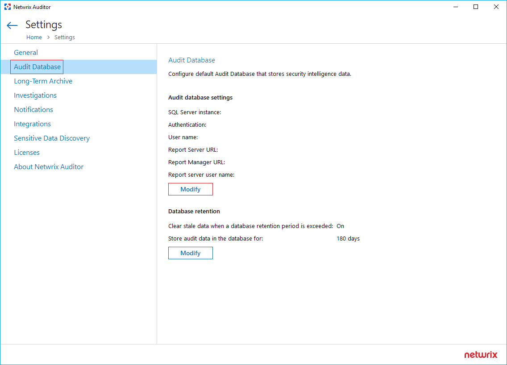

# Deploying the Report Server Database

## Question

How to set up SQL Server Reporting Services for the first time or during the Netwrix Auditor migration?

## Answer

In case you are configuring SQL Server Reporting Services for the first time, grant the appropriate role permissions to the user. Refer to the following link for additional info: /docs/auditor/10.8/requirements Launch the **Report Server Configuration Manager** and connect to the Report Server.

> **NOTE:** In most cases, there is only one Report Server to be hosted locally on the same server as SQL.

### Set Up Web Service URL and Web Portal URL

In your SQL server, run **Report Server Configuration Manager**. Select the SQL Server to connect to, and click **Connect**. Refer to the following steps to configure your Report Server instance:

1. In the left pane, select **Web Service URL**. Click **Apply** − this will initialize the Report Server URL.

   > **NOTE:** This action is required only during the initial setup.

2. In the left pane, select **Web Portal URL**. Click **Apply** − this will initialize the Report Manager URL.

   > **NOTE:** This action is required only during the initial setup.

### Set Up Report Server Database

1. In the left pane of **Report Server Configuration Manager**, select **Database**. Click **Change Database**.

2. Check the **Create a new report server database** check and click **Next**.

3. In the **Database Server** tab, confirm the SQL Server instance and click **Next**.

   > **NOTE:** In case you are unable to proceed with the authentication type specified, make sure the user has the appropriate role permissions. If you need to review the SQL permissions, refer to the following link: /docs/auditor/10.8/admin/reports/types/stateintime

4. In the **Database** tab, you can use the default database name or change it. Click **Next** to proceed to the next setup stage.

5. In the **Credentials** tab, provide the credentials for the service account to connect to the Report Server database. You can also input credentials for any account with `db_owner` and `db_creator` roles. Click **Next** to proceed.

6. Review the summary and confirm the configuration by clicking **Next**.

### Set Up Audit Database in Netwrix Auditor

Once the database has been successfully deployed, provide the Report Server URL and Report Manager URL in Netwrix Auditor settings.

1. In the main Netwrix Auditor screen, click **Settings**. In the left pane, select the **Audit Database** tab and click **Modify** under the **Audit Database** section.

   

2. Input the credentials and click **Next**.

3. Input the Web Service URL in the **Report Server URL** field. Input the Web Portal URL in the **Report Manager URL** field. Click **Finish** to save changes.

Netwrix Auditor should now be able to process and generate reports.

## Related articles

- Requirements – SQL Server Reporting Services · v10.6  
  /docs/auditor/10.8/requirements

- SQL Server State-In-Time Reports · v10.6  
  /docs/auditor/10.8/admin/reports/types/stateintime
