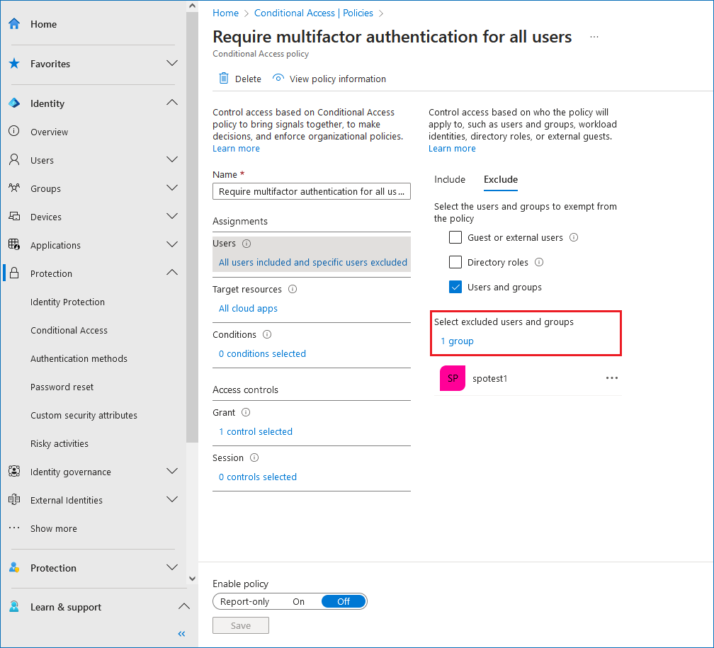
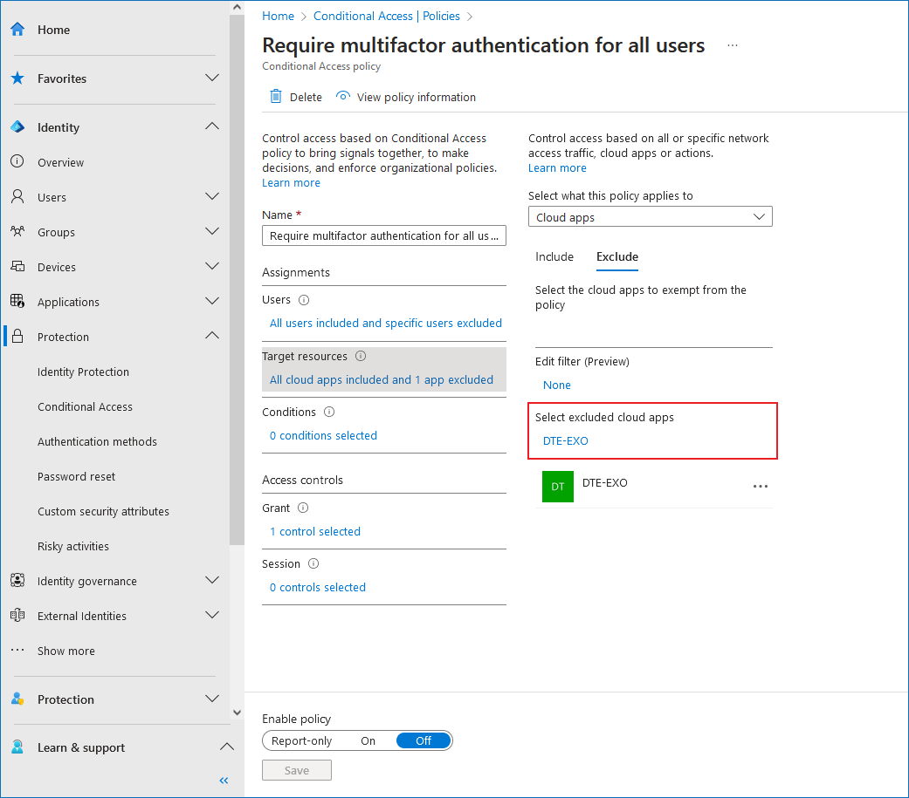

# Disable Multi-Factor Authentication for Microsoft 365 Service Accounts

## Question

How to disable multi-factor authentication (MFA) for a Netwrix Auditor service account for your Microsoft 365 sources — Entra ID (Azure AD), Exchange Online, SharePoint Online and Microsoft Teams?

## Answer

> **NOTE:** To manage policies, the Conditional Access Administrator role is required. Learn more about the role in Azure AD Built-in Roles — Conditional Access Administrator ⸱ Microsoft (https://learn.microsoft.com/en-us/azure/active-directory/roles/permissions-reference#conditional-access-administrator).

To disable MFA for your data-collecting account in any Microsoft 365 source, use the **Conditional Access** feature. It lets you exclude particular users and apps from a policy. Follow these steps for the initial setup:

1. Log in to the Entra ID portal, and go to the **Conditional Access** menu located under the **Protection** section: https://entra.microsoft.com/#view/Microsoft_AAD_ConditionalAccess/ConditionalAccessBlade/~/Overview/fromNav/Identity.
2. If you do not have a policy configured, follow the steps in Common Conditional Access Policy — Require MFA for All Users ⸱ Microsoft (https://learn.microsoft.com/en-us/azure/active-directory/conditional-access/howto-conditional-access-policy-all-users-mfa#create-a-conditional-access-policy). Otherwise, if you have an MFA policy configured, proceed to the next step.
3. In the left pane, select **Policies**. Select the MFA policy to be edited. You can either exclude a user from the MFA policy or exclude a particular app used.

   - To exclude a user from the MFA policy:
     1. Click the highlighted text under the **Users** section.
     2. Click the **Exclude** tab, and check the **Users and groups** checkbox.
     3. Select the service user to be used in the **Select excluded users and groups** window, and click **Select**.
     4. To complete the setup, click **Save** in the bottom left corner.

     

   - To exclude an app from the MFA policy:
     1. Click the highlighted text under the **Target sources** section.
     2. Click the **Exclude** tab, and click the highlighted text under **Select excluded cloud apps**.
     3. Select the app to be used in the **Select excluded cloud apps** window, and click **Select**.
     4. To complete the setup, click **Save** in the bottom left corner.

     

Refer to the following articles for additional information on data-collecting account setup for your Microsoft 365 sources:

- Microsoft 365 — Permissions for Microsoft Entra ID Auditing ⸱ v10.6 https://docs.netwrix.com/docs/auditor/10.8/configuration/microsoft365/microsoftentraid)
- Microsoft 365 — Permissions for Exchange Online Auditing ⸱ v10.6 https://docs.netwrix.com/docs/auditor/10.8/configuration/microsoft365/exchangeonline)
- Microsoft 365 — Permissions for SharePoint Online Auditing ⸱ v10.6 https://docs.netwrix.com/docs/auditor/10.8/configuration/microsoft365/sharepointonline)
- Microsoft 365 — Permissions for Teams Auditing ⸱ v10.6 https://docs.netwrix.com/docs/auditor/10.8/configuration/microsoft365/teams)

### Related articles

- Azure AD Built-in Roles — Conditional Access Administrator ⸱ Microsoft (https://learn.microsoft.com/en-us/azure/active-directory/roles/permissions-reference#conditional-access-administrator)
- Microsoft Entra ID — Conditional Access ⸱ Microsoft (https://entra.microsoft.com/#view/Microsoft_AAD_ConditionalAccess/ConditionalAccessBlade/~/Overview/fromNav/Identity)
- Common Conditional Access Policy — Require MFA for All Users ⸱ Microsoft (https://learn.microsoft.com/en-us/azure/active-directory/conditional-access/howto-conditional-access-policy-all-users-mfa#create-a-conditional-access-policy)
- Microsoft 365 — Permissions for Microsoft Entra ID Auditing ⸱ v10.6 https://docs.netwrix.com/docs/auditor/10.8/configuration/microsoft365/microsoftentraid)
- Microsoft 365 — Permissions for Exchange Online Auditing ⸱ v10.6 https://docs.netwrix.com/docs/auditor/10.8/configuration/microsoft365/exchangeonline)
- Microsoft 365 — Permissions for SharePoint Online Auditing ⸱ v10.6 https://docs.netwrix.com/docs/auditor/10.8/configuration/microsoft365/sharepointonline)
- Microsoft 365 — Permissions for Teams Auditing ⸱ v10.6 https://docs.netwrix.com/docs/auditor/10.8/configuration/microsoft365/teams)
