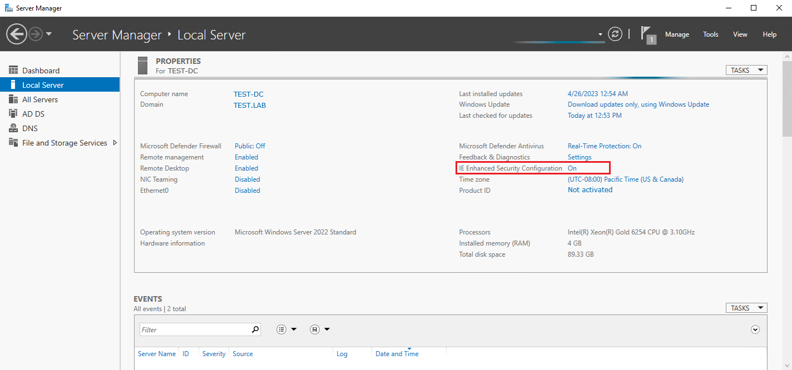
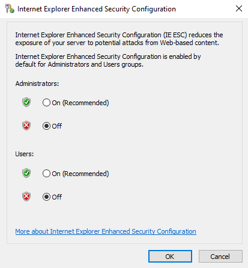

# Error Generating a Report in SSRS − HTTP Error 401 − Unauthorized

## Symptom

You've encountered the following error:

```
HTTP Error 401 - Unauthorized. Provide another credentials or change security settings in Internet Explorer.
```

## Causes

- Misconfigured Internet Explorer security settings.
- IE Enhanced Security Configuration enabled on the SQL Server end.
- Incorrect SSRS account permissions.
- SSRS account is included in the Protected Users security group.
- Your SQL Server is not added to the Local Intranet group as a trusted host.
- Your account has insufficient permissions to access the Report Server.

> IMPORTANT: Unless configured otherwise, SQL Server Reporting Services require NTLM authentication to be enabled to operate. Learn more in Configure Windows Authentication on the Report Server ⸱ Microsoft: https://learn.microsoft.com/en-us/sql/reporting-services/security/configure-windows-authentication-on-the-report-server?view=sql-server-ver16

## Resolutions

- Review the Internet Explorer security settings.

  1. On the affected server, open **Control Panel** and select **Internet Options**. Alternatively, type **Internet Options** in the **Search** bar.
  2. Select the **Security** tab, select the **Internet** zone, and click **Custom level**.
  3. Locate the **User Authentication** subnode, and select the **Automatic logon with current user name and password** option. Click **OK** to save the changes.

- Disable IE Enhanced Security Configuration.

  1. Launch **Server Manager**.
  2. In the left pane, click **Local server**.
  3. Click **On** to the right of **IE Enhanced Security Configuration**.

  

  4. In the configuration window, switch both **Administrators** and **Users** categories to **Off**.
  5. Click **OK** to save changes.

  

- Review your SSRS account permissions. For additional information, refer to: SQL Server Reporting Services: Configure SSRS Account · v10.6 — /docs/auditor/10.8/requirements

- Remove the SSRS account from the Protected Users security group. Learn more about Protected Users: Protected Users Security Group ⸱ Microsoft — https://learn.microsoft.com/en-us/windows-server/security/credentials-protection-and-management/protected-users-security-group

- Add your SQL Server to the Local Intranet group locally on every server used to access SSRS reports via the Netwrix Auditor administrative console. If setting at GPO level, the settings should be **Level 1**.

  1. In the Run command, open `inetcpl.cpl`.
  2. In the **Security** tab, select the **Local intranet** zone and click the **Sites** button.
  3. Click the **Advanced** button and enter the SQL Server address to add it to the Local Intranet zone.

- Make sure your account has the **Browser** role assigned.

  1. Log in to the Report Manager under the administrator account.
  2. Click the three horizontal dots menu for the **Netwrix Auditor** reports folder and click **Manage**.
  3. In the left pane, select **Security**, and either click **Edit** next to the corresponding user to select a different role or add a new user by clicking **Add group or user**.
  4. Once you've assigned the **Browser** role to the account, save the changes and try accessing the reports while logged in under your usual account.

- Rebuild the **Reports** folder.

  1. In elevated PowerShell, execute the following command to stop the corresponding service:

     ```powershell
     Stop-Service -DisplayName "Netwrix Auditor Management Service"
     ```

  2. Open Report Manager in your browser.

     - You can find the Report Manager URL in your main Netwrix Auditor menu > **Settings** > **Audit Database** tab > **Report Manager URL**.

  3. In the main SQL Server Reporting Services window, locate the **Netwrix Auditor** folder.
  4. Click the meatball **⸱⸱⸱** button, and select **Delete**.
  5. Follow the path provided:

     ```
     C:\ProgramData\Netwrix Auditor\Reports
     ```

  6. Delete the contents of the **Reports** folder.
  7. Once deleted, follow the path provided to find the `Reports.zip` archive in the root of the folder:

     ```
     C:\ProgramData\Netwrix Auditor
     ```

  8. Extract the contents of the **Reports.zip** archive to the `C:\ProgramData\Netwrix Auditor\Reports` folder.
  9. In elevated PowerShell, execute the following command to start the corresponding service:

     ```powershell
     Start-Service -DisplayName "Netwrix Auditor Management Service"
     ```

  10. Wait for about 10 minutes for reports to upload to your Report Manager. You can track the progress by following the Report Manager URL and entering the **Netwrix Auditor** folder.
  11. Once the affected report is uploaded, run the report again.

## Related articles

- Netwrix Auditor Settings − Investigations · v10.6 — /docs/auditor/10.8/admin/settings
