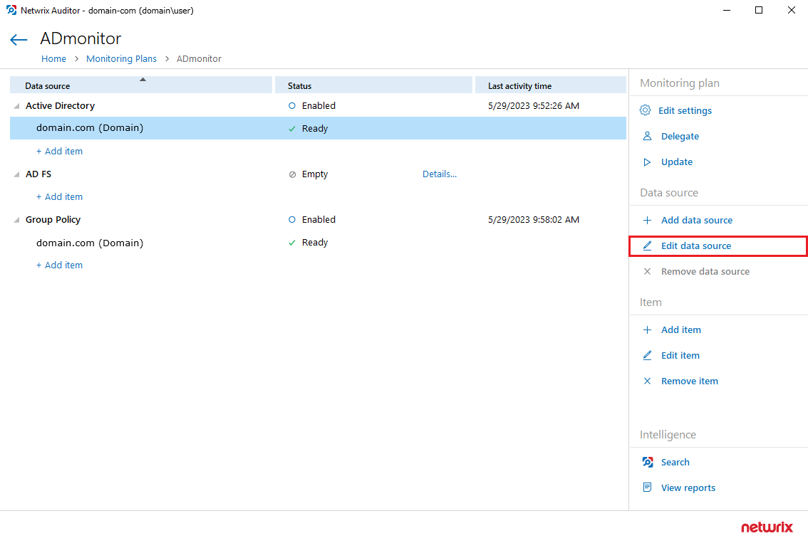
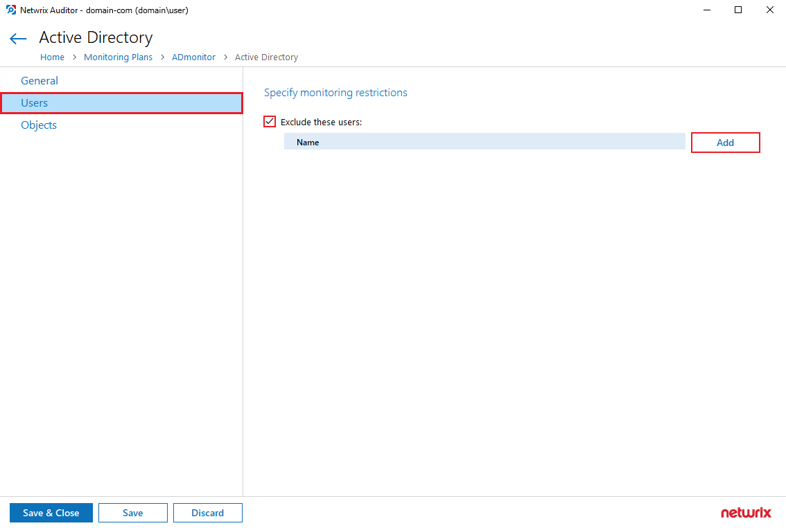
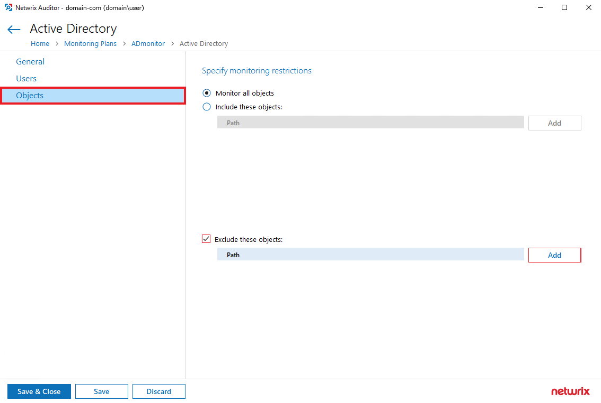

# How to Exclude Users and Objects from Monitoring Scope in Netwrix Auditor UI

## Question

How to exclude specific users and objects from the monitoring scope via Netwrix Auditor UI?

## Answer

You can exclude specific users and objects from your monitoring scope using the following tabs in the Netwrix Auditor UI:

- the **Users** tab to exclude particular users performing activity in Active Directory.
- the **Objects** tab to exclude (or include) activity performed to objects in Active Directory.

> **Note:** Examples of object exclusion rules for **Objects** are provided below.

1. In the main Netwrix Auditor menu, select **Monitoring plans** under **Configuration**.
2. Select the relevant monitoring plan, select the data source and click **Edit**.
3. Select the data source and click **Edit data source**.

   
4. In the left pane, select **Users**. Check the **Exclude these users:** checkbox and click **Add** to add users to be excluded from the monitoring plan. Once all the users are added, click **Save & Close** in the bottom left corner.

   
5. For objects, select the **Objects** tab in the left pane, check the **Exclude these objects** checkbox and click **Add** to exclude objects from the monitoring scope. Once you've added the objects, click **Save & Close**.

   

The following examples explain how the exclusion rules work for **Objects**. Same logic applies to the inclusion rules:

- `dc11.local/OU` will exclude the OU itself. However, objects within this OU will not be excluded.
- `dc11.local/OU/*` will exclude objects within the OU. However, the OU itself will not be excluded.
- `dc11.local/OU*` will exclude the OU itself, all objects within it, and also all objects whose path begins with `dc11.local/OU` (like `dc11.local/OU_HQ`).

For additional information on omit lists and excluding data sources, refer to the following article: [How to Use Omit Lists](https://docs.netwrix.com/docs/kb/auditor/how-to-use-omit-lists)
