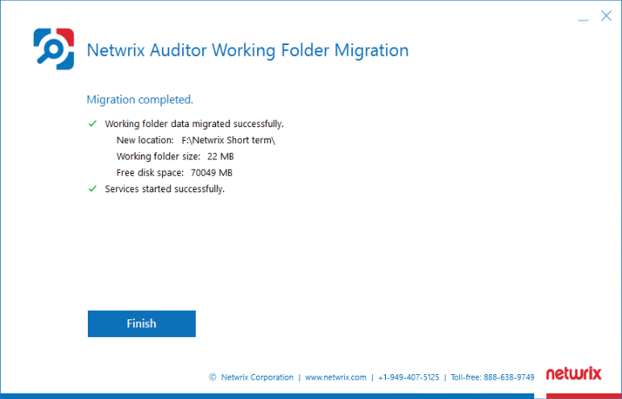
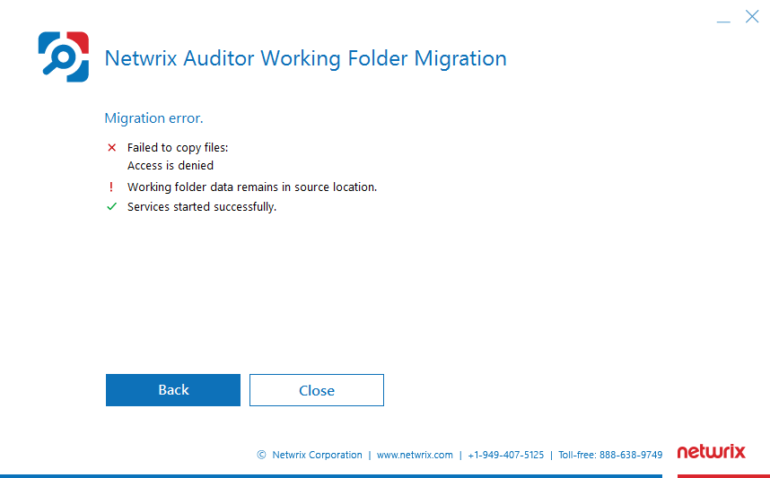

# How to Migrate Netwrix Auditor Working Folder to a New Location

## Question

How to move the Netwrix Auditor Working Folder to a new location?

## Answer

The size of your Working Folder may grow significantly (up to 1 TB) depending on the workload, especially during activity peaks. If your system drive capacity is limited, you might want to keep the temporary files and trace logs on another drive, i.e. change the Working Folder default location.

> **NOTE:** Netwrix Auditor has two file storages used for different purposes:
>
> - Long-Term Archive, a repository of collected audit data stored in proprietary Netwrix format (activity records). Audit data is kept in the Long-Term Archive for 10 years as per default settings. The default Long-Term Archive location is ` %ProgramData%\Netwrix Auditor\Data`. For more information on setting Long-Term Archive up, refer to the following article: [Long-Term Archive](https://docs.netwrix.com/docs/auditor/10_8/admin/settings/longtermarchive)
>
>   If you would like to move Long-Term Archive to another location, refer to the following article: [How to Move Long-Term Archive to a New Location](/docs/kb/auditor/how-to-move-long-term-archive-to-a-new-location.md).
>
> - Working Folder, a repository for Netwrix Auditor to store operational information (configuration files for product components, log files, and other data). To ensure the audit trail continuity, Netwrix Auditor also caches some audit data locally in the Working Folder prior to placing it to the Long-Term Archive or any audit database. Audit data is kept in the Working Folder for a shorter period of up to several weeks. The default Working Folder location is ` %ProgramData%\Netwrix Auditor\`.

### Planning and preparation

1. To track your current Working Folder capacity and estimate the disk space you will need on the new target drive, use the **Working Folder** widget of the Health Status dashboard. Refer to the following articles for additional information: [Netwrix Auditor Operations and Health − Health Status Dashboard](https://docs.netwrix.com/docs/auditor/10_8/admin/healthstatus/dashboard/overview) and [How to Check the Netwrix Auditor Health Status](/docs/kb/auditor/how-to-check-the-netwrix-auditor-health-status.md).
2. The Working Folder can be stored only locally on the Netwrix server — prepare a local folder for the migration process. Make sure the target folder location differs from the Long-Term Archive location.

   > **NOTE:** Network shares are not supported.
3. To run the `WorkingFolderMigration.exe` utility, the current account must be a member of the local **Administrators** group.

### Working Folder migration procedure

1. Navigate to ` %Netwrix Auditor installation folder%\Audit Intelligence` and launch the `WorkingFolderMigration.exe` utility.
2. Specify the target folder in the **Specify new destination** field.

   

   > **IMPORTANT:** Network shares are not supported − make sure the new Working Folder destination is a local folder.
3. Click **Migrate**. All temporary data from ` %ProgramData%\Netwrix Auditor\` will be copied to the specified target folder.
4. Wait for the migration process to complete. Your final screen should look like the following screenshot in case the migration process was completed correctly:

   

If the migration process was completed successfully, proceed to steps described in **Scenario A**.

In case any error occurs during the migration process, the Working Folder contents will remain in the original location. The final screen might look like the following screenshot:

In case the migration process was not completed successfully, follow the steps described in **Scenario B**.

### Post-migration actions − Scenario A

If migration was completed successfully, refer to the following steps:

1. Take 1 to 2 days to verify the new configuration — make sure there are no related errors in the Netwrix Auditor Health log.
2. Once you have verified the proper operation, open the source location (original Working Folder) to remove old trace logs. Locate the following folders:
   - ` %ProgramData%\Netwrix Auditor\Logs\Archive`
   - ` %ProgramData%\Netwrix Auditor\AuditCore\Logs`
   - ` %ProgramData%\Netwrix Auditor\ShortTerm`
   - ` %ProgramData%\Netwrix Auditor\SyslogCollection`
   - ` %ProgramData%\Netwrix Auditor\FileStorageAuditor`
3. Make a backup copy of the contents, then remove these folders

> **NOTE:** The ` %ProgramData%\Netwrix Auditor\AuditCore` folder data other than trace logs usually does not occupy much space. If you do have to have this folder cleared, it is recommended to double-check and back up the contents before the cleanup.

### Post-migration actions − Scenario B

If migration was completed with any errors, refer to the following steps:

1. **In the source location** − Keep all source files as is in the source location (original Working Folder). Do not delete them from the source folder. Netwrix Auditor will continue working using the original folder files.

   > **IMPORTANT:** Netwrix Auditor configuration changes only after a successful migration. Otherwise, if any error occurs, the configuration remains the same with the original Working Folder path preserved. Keep all files in the original location for Netwrix Auditor to be able to use that folder.
2. **In the target location** − As the Netwrix Auditor configuration does not change in case of unsuccessful migration, you can safely remove the files found in the target location. After that you can run the migration utility once again. In case errors still occur during the migration process, contact Netwrix Technical Support: [Open a Ticket · Netwrix 🧭](https://www.netwrix.com/tickets.html#/open-a-ticket)

## Related articles and links

- [Long-Term Archive](https://docs.netwrix.com/docs/auditor/10_8/admin/settings/longtermarchive)
- [How to Move Long-Term Archive to a New Location](/docs/kb/auditor/how-to-move-long-term-archive-to-a-new-location.md)
- [Netwrix Auditor Operations and Health − Health Status Dashboard](https://docs.netwrix.com/docs/auditor/10_8/admin/healthstatus/dashboard/overview)
- [How to Check the Netwrix Auditor Health Status](/docs/kb/auditor/how-to-check-the-netwrix-auditor-health-status.md)
- [Open a Ticket · Netwrix 🧭](https://www.netwrix.com/tickets.html#/open-a-ticket)
