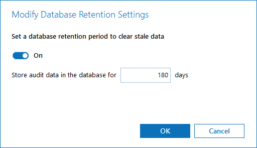
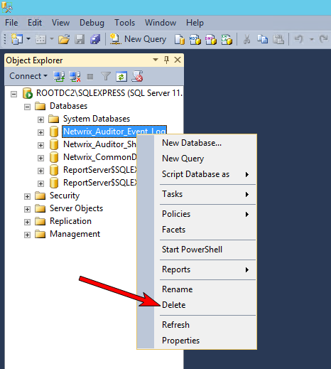
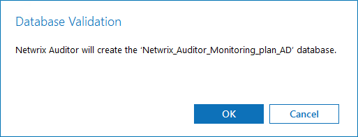
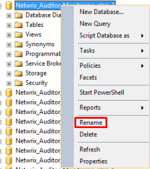
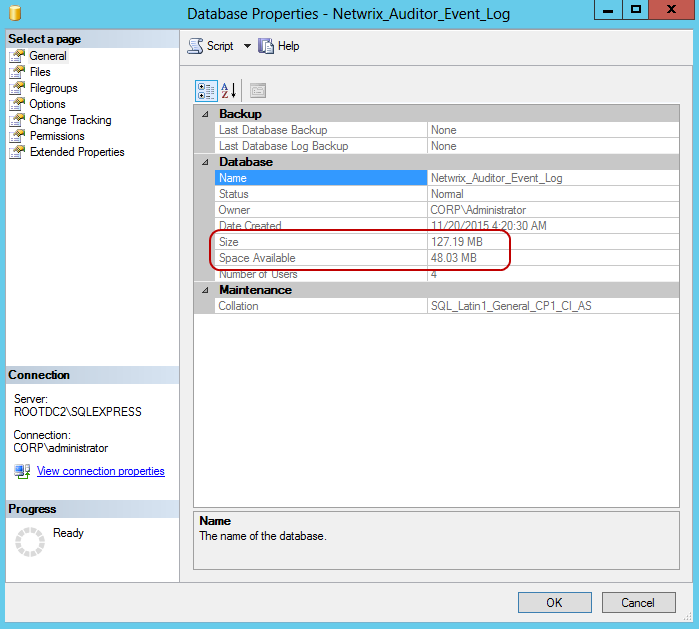

# How to Reduce Audit Database Size for Netwrix Auditor

## Question

How to reduce the Netwrix Auditor audit database size?

## Answer

> **NOTE:** Data removed after altering or deleting audit databases will no longer be readily available to be searched and reported. To query that data, you'll have to perform an investigation. For additional data on investigations, refer to the following article: Auditor Settings – Investigations · v10.6: https://docs.netwrix.com/docs/auditor/10.8/admin/settings

You can configure the audit database retention settings by following the next steps:

1. Launch Netwrix Auditor and open the **Settings** menu.
2. In the left pane, select the **Audit Database** tab.
3. Click **Modify** under the **Database Retention** section and input the retention period in days.

   

   - **Tip:** Longer retention periods results in larger audit databases.

Data that exceeds the new retention period will be removed during the next collection, reducing the audit database size.

> **NOTE:** If you are using SQL Server Express to save your audit data, you may find your audit databases quickly reach the 10 GB limit. Instead of fine-tuning retention settings, you may choose to either delete and recreate your audit databases or rename the older full database for new information to be kept in a new database. Refer to the following steps for additional information on the process.

### Deleting audit database

1. In Windows Services Manager on your Netwrix host, stop both **Netwrix Auditor Archive Service** and **Netwrix Auditor Management Service**.
2. Run your SQL Management Studio instance and navigate to ` %SQL_Server_database_name% > Databases` to select the database you are going to delete.

   

3. In the Delete Object window, check both option checkboxes:
   1. Delete backup and restore history information for databases.
   2. Close existing connections.
4. Once the database has been deleted, restart **Netwrix Auditor Archive Service** and **Netwrix Auditor Management Service**.

The audit database has now been successfully deleted. Refer to the **Rebuilding audit databases** section for next steps.

### Rebuilding audit databases

1. Select an affected monitoring plan and click **Edit** > click **Edit settings** in the right pane.
2. In the left pane, select the **Audit Database** tab. Review the database name and update it if necessary.  
   Netwrix Auditor allows you to specify settings for each monitoring plan individually, so you'll have to rebuild the database for each monitoring plan separately.

   

3. Refresh or reopen the SQL Management Studio to ensure the audit database was rebuilt.

### Renaming audit databases

1. In Windows Services Manager on your Netwrix host, stop both **Netwrix Auditor Archive Service** and **Netwrix Auditor Management Service**.
2. Run your SQL Management Studio instance and navigate to ` %SQL_Server_database_name% > Databases` to select the database you are going to rename.
3. Right-click the selected database and select **Rename**.

   

4. Add **_old** or another word to the end of the database name to differentiate it from other databases.
5. Once the database has been renamed, restart **Netwrix Auditor Archive Service** and **Netwrix Auditor Management Service**.

The audit database has now been successfully renamed. Refer to the **Rebuilding audit databases** section for next steps.

> **NOTE:** Both renaming and deleting processes are temporary non-scalable workarounds for SQL Server Express limitations. We strongly recommend using Standard version of SQL Server to avoid potential data loss and issues with databases.

### Setting the retention period

> **NOTE:** In order to correctly set the retention period, you have to estimate your audit database growth. If you are using Netwrix Auditor 9.6 or newer, this can be done by monitoring **Health Status** > **Database statistics**.

1. Run your SQL Management Studio instance and navigate to ` %SQL_Server_database_name% > Databases` to locate the required database.
2. Right-click it and select **Properties**.

   

3. Review **Size** and **Space Available** parameters.

> **NOTE:** This should be done over the course of several days to get the best estimate of growth.
