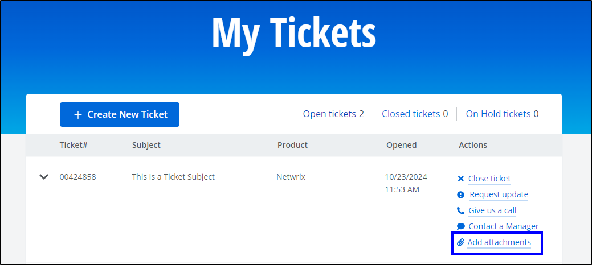
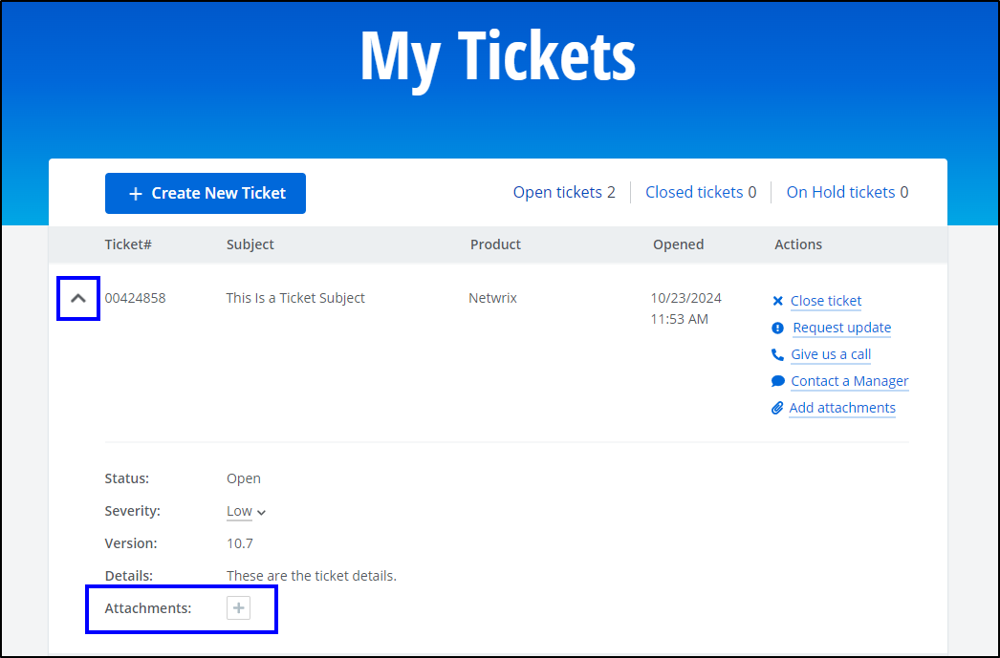

# How to Send Netwrix Auditor Logs

## Question

- What logs might be requested by Netwrix Technical Support?
- How can you upload Netwrix Auditor logs to a support ticket?

## Answer

### Technical Support checklist

Netwrix Technical Support might request a collection of your Netwrix Auditor logs for troubleshooting purposes. Make sure you gather the following items to help your Technical Support Engineer resolve your issue.

- **Netwrix Auditor System Health event log**. Refer to the following article for additional information on exporting the System Health event log: https://docs.netwrix.com/docs/kb/auditor/how-to-save-and-zip-netwrix-auditor-system-health-event-log (How to Save and Zip Netwrix Auditor System Health Event Log).

- **Netwrix Auditor configuration files**. Navigate to ` %Working Folder%\AuditCore\ConfigServer ` and copy the **ConfigServer** folder. The default location of the **ConfigServer** folder is `C:\ProgramData\Netwrix Auditor\AuditCore\ConfigServer`.

- **Trace logs**. If requested, navigate to ` %Working Folder%\Netwrix Auditor\Logs `, and copy the required folder(s).

> **NOTE:** Your Technical Support Engineer will request a specific subdirectory of the **Logs** folder. Please do not send the entire **Logs** folder unless requested.

> **NOTE:** If you are unable to locate Working Folder, refer to the following options to perform on your Auditor server to establish the folder location:
>
> 1. Run the following line in Command Prompt in your Auditor server to get the value of the `DataPathOverride` subkey entry. The output will contain the location of Working Folder in your Auditor server:
>
> ```batch
> reg query "HKEY_LOCAL_MACHINE\SOFTWARE\WOW6432Node\Netwrix Auditor\DataPathOverride"
> ```
>
> 2. Run the following line in PowerShell in your Auditor server to get the value of the `DataPathOverride` subkey entry. The output will contain the location of Working Folder in your Netwrix Auditor server:
>
> ```powershell
> Get-ItemPropertyValue -Path "HKLM:\SOFTWARE\WOW6432Node\Netwrix Auditor\DataPathOverride" -Name "(Default)"
> ```
>
> 3. Review the string entry under the following registry subnode in your Netwrix Auditor server. The **Value Data** field contains the location of Working Folder:
>
> ```registry
> Computer\HKEY_LOCAL_MACHINE\SOFTWARE\WOW6432Node\Netwrix Auditor\DataPathOverride
> ```

### Uploading the logs

1. Once you have located all the required logs, copy them to a single folder and compress it by right-clicking the folder and selecting **Send to** > **Compressed (zipped) folder**.

2. Log in to the Customer Portal and attach the archived logs to the opened ticket. Use the following link to open the **Open tickets** page: https://www.netwrix.com/tickets.html#/tickets/open (My Tickets — Open Tickets).

> **NOTE:** Once you have opened the **Open Tickets** page and identified the corresponding ticket (with a matching ticket #), you can attach the logs via one of the following ways:
>
> - Click the **Add attachments** button located under the **Actions** column of the ticket.  
>   
>
> - Expand the ticket details by clicking the **down carat (▼)** button and click the **plus (+)** button next to **Attachments**.  
>   

## Related links

- How to Save and Zip Netwrix Auditor System Health Event Log: https://docs.netwrix.com/docs/kb/auditor/how-to-save-and-zip-netwrix-auditor-system-health-event-log
- My Tickets — Open Tickets: https://www.netwrix.com/tickets.html#/tickets/open
