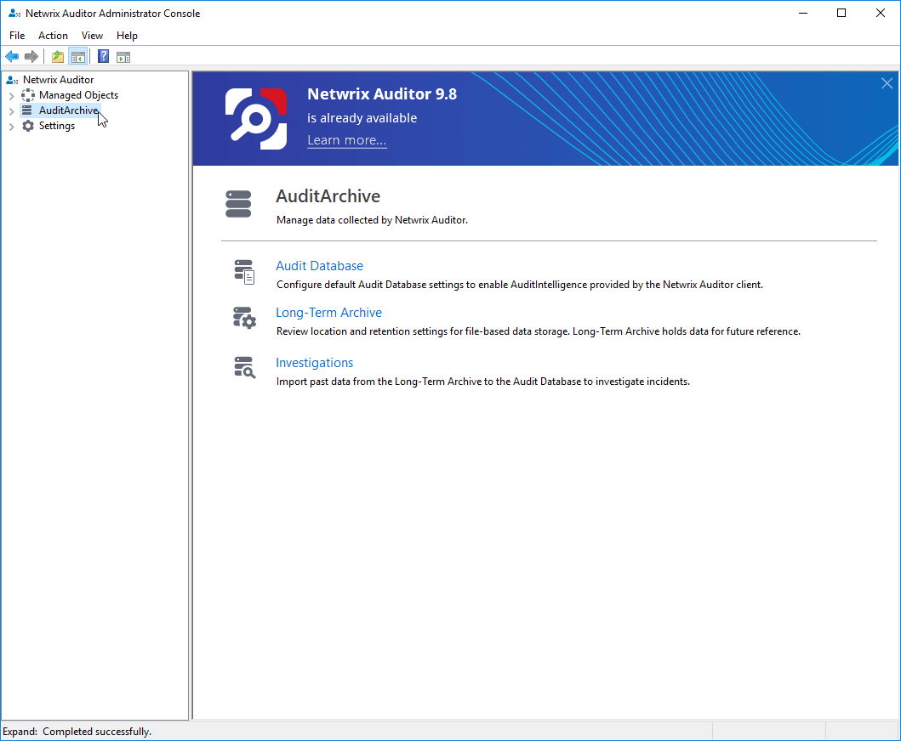

# How to Upgrade Netwrix Auditor

## Question

How to update Netwrix Auditor?

## Answer

> **NOTE:** It is highly recommended to capture a snapshot of the server.

> **NOTE:** Before you begin, launch a PowerShell session as Administrator and execute the following command:
>
> ```powershell
> Stop-Service -Displayname Netwrix*
> ```
>
> This will stop all Netwrix services and prevent complications during the upgrade.

### Netwrix Auditor v.9.96 and later

Refer to the following video for step-by-step instructions on upgrading to the latest Netwrix Auditor version:

- Video: https://www.youtube.com/embed/M_IfPaf_7ig

For the text version of the guide, refer to the following documentation article: https://docs.netwrix.com/docs/auditor/10.8/install

### Netwrix Auditor v.9.95 and earlier

> **NOTE:** For additional information on upgrade increments, refer to the following article: https://docs.netwrix.com/docs/kb/auditor/upgrade-increments-for-netwrix-auditor

The following steps represent a scenario for upgrading from v.9.95 to v.9.96. The upgrade progress for Netwrix Auditor version 8.0 up to 9.96 will be similar. If you are upgrading from an earlier version, view the additional steps under **Post Upgrade** > **Legacy Steps** further in this article.

1. When upgrading, it is recommended to log in via your data collection service account. Right-click the installer and choose **Run as administrator**. The following window will include options to view documentation for the new version.
2. Click the **Install** button to continue the upgrade. You will confirm the version you’re upgrading to in the next window.
3. Confirm the version and click **Next**.
4. Read the EULA, check the **I accept the terms of the License Agreement** checkbox and click **Next**.
5. Click **Install**. Once the installation process is complete, you should see the confirmation.
6. Congratulations, you have successfully upgraded!

## Post Upgrade

Upon completion, Netwrix Auditor will launch. To confirm integrity, run the following tests:

- **Configuration:** View your Monitoring Plans and settings to confirm the configuration successfully carried over.
- **SQL Connectivity:** On the homepage click **Search** and run a search with your desired parameters. If data is returned, SQL connectivity is validated.
- **SSRS Connectivity:** On the homepage click **Reports** and attempt to view a report for a data source that you are currently auditing. If the report successfully builds, SSRS connectivity is validated.
- **Legacy Steps:** On version 8.5 and lower, you will need to launch the Netwrix Auditor Administrator Console and manually upgrade the Audit Databases in SQL.
  - Click **Audit Database** and then click **Upgrade**.

  

## Related articles

- Upgrade to the Latest Version ⸱ 10.7 — https://docs.netwrix.com/docs/auditor/10.8/install
- Upgrade Increments for Netwrix Auditor — https://docs.netwrix.com/docs/kb/auditor/upgrade-increments-for-netwrix-auditor
