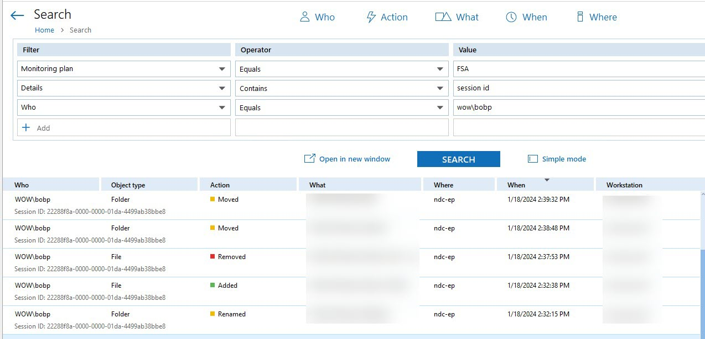

# What Is SessionID in Netwrix Auditor for File Servers?

## Question

What is SessionID in Netwrix Auditor for File Servers?

## Answer

This attribute is based on the user’s logon ID within the current session. Being unique for a user’s logon session, it usually helps to distinguish the events and changes that occurred within that session.

Session IDs are used to identify changes made by users with unique logon ID's. Session IDs are a combination of both the logon ID itself and the current session associated with this logon ID, to help identifying who made the change. Thus, session ID can be changed due to the fact that Netwrix would count that as a separate activity record too.

In addition, Netwrix Auditor generates the following attribute besides Session ID, associated with the object and reserved for internal use:

**Statement ID** — This attribute appears if an object was moved/renamed due to its root object modifications.

Since the product associates Session IDs with the current session of the user, this is expected behavior to see the different session ID for the same user after that user was logged out.

### Related Article

- [How Does Merging Logon Activity Events Work?](https://docs.netwrix.com/docs/kb/auditor/how-does-merging-logon-activity-events-work.md)
