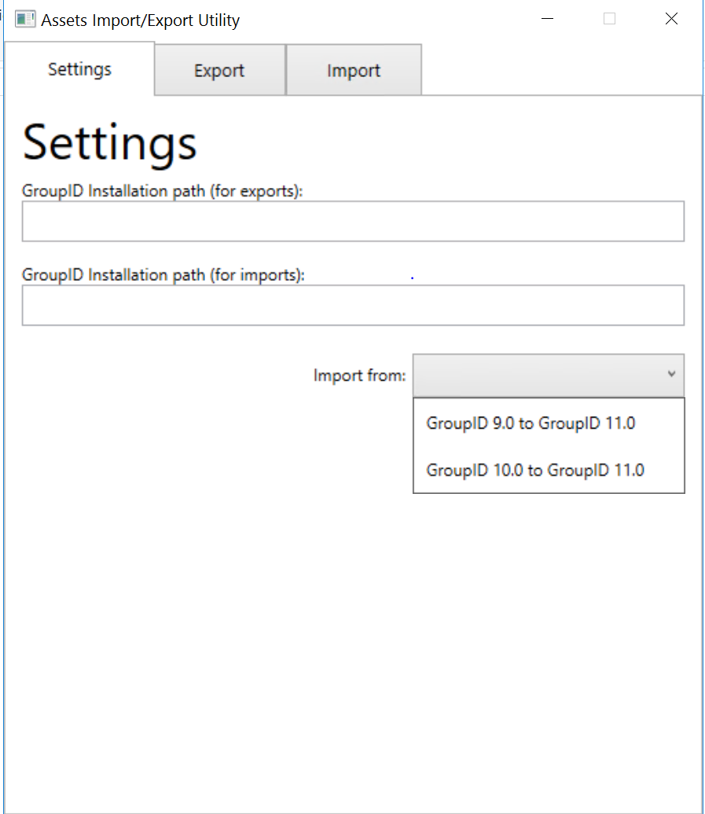
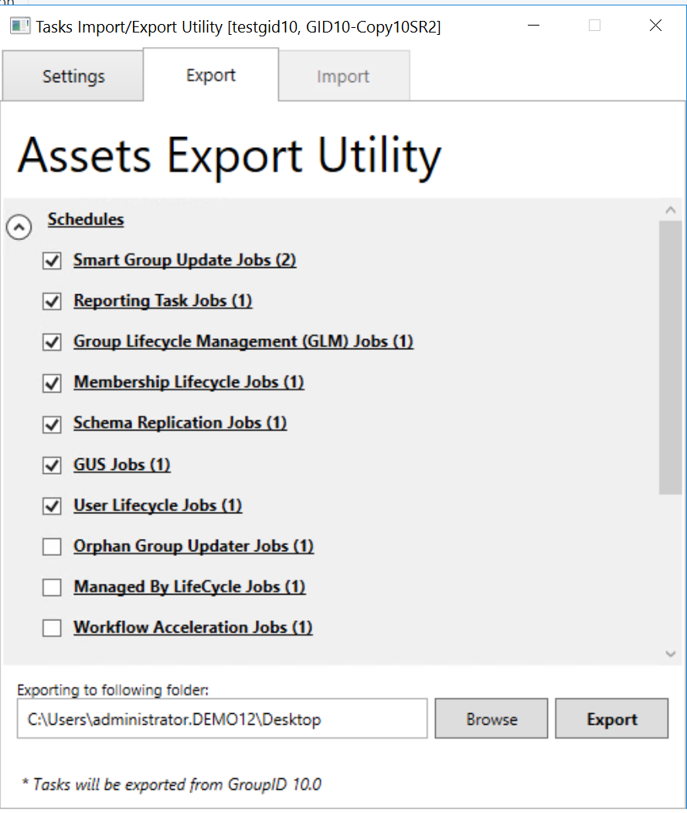
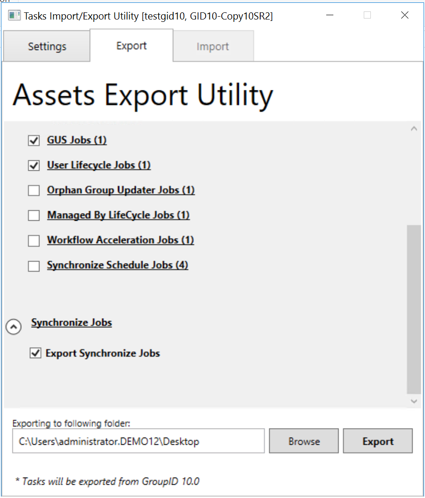
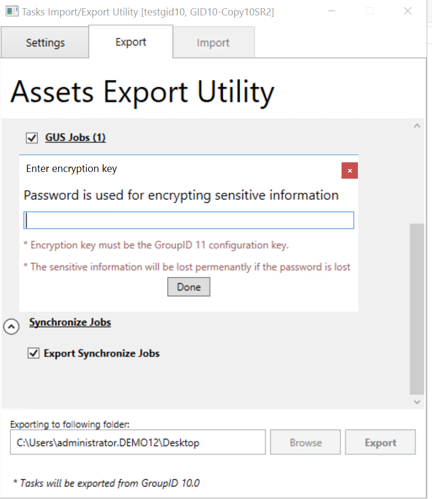
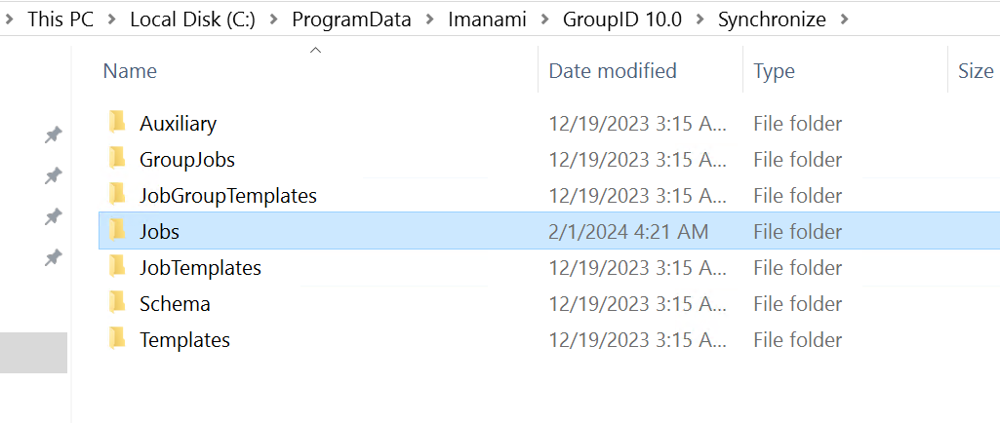
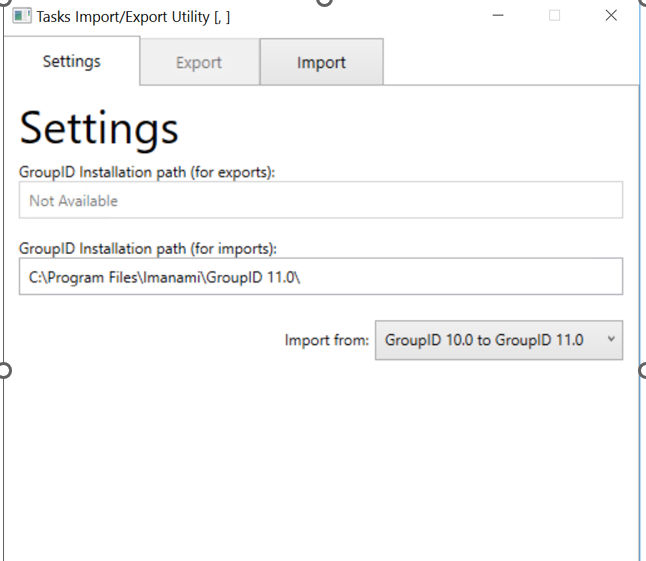
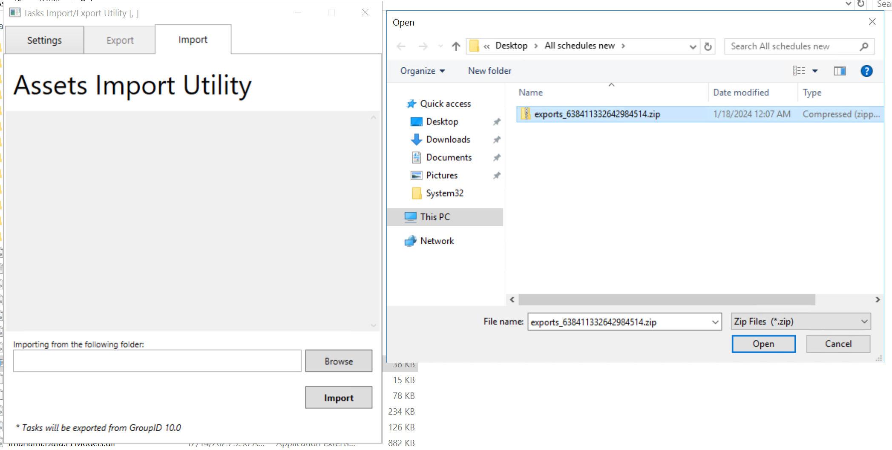
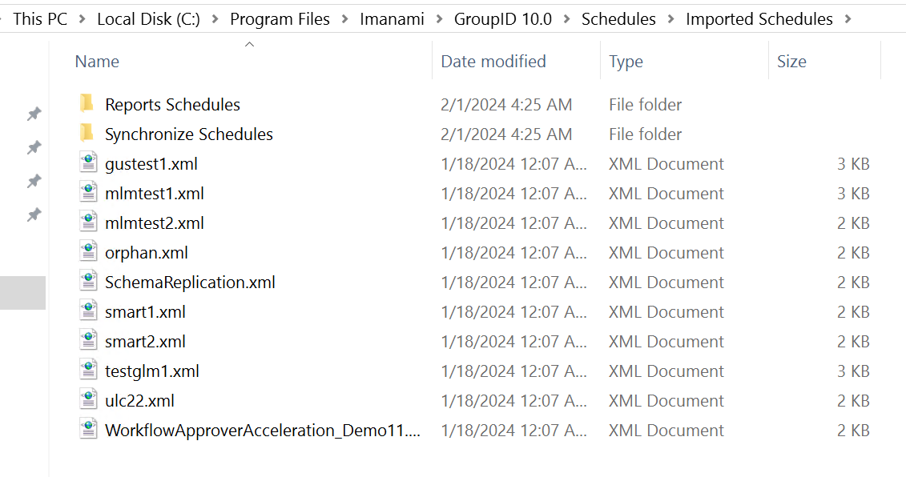

# Asset Export Utility Configuration

## Overview

This article provides step-by-step instructions for migrating schedules and synchronize jobs from Netwrix Directory Manager 10 to Netwrix Directory Manager 11 using the **Asset Export** utility. The process involves exporting assets from Directory Manager 10, preparing the Directory Manager 11 server, and importing the assets.

## Instructions

### Prepare the Directory Manager 11 Server

- Ensure the Directory Manager 10 installation folder is present at the default location (`C:\Program Files\Imanami\GroupID10`) on the Directory Manager 11 server.
- Copy the Directory Manager 10 folder from `ProgramData` to the Directory Manager 11 server.

### Export Assets from Directory Manager 10

1. Run the **Asset Export** utility on the Directory Manager 10 server.
2. Select the option **Directory Manager 10.0 to Directory Manager 11.0**.
3. Select the schedules and synchronize jobs to export.
4. Click **Export** and select a folder to save the exported assets.

  

### Provide the Encryption Key

1. When prompted, enter the encryption key (passphrase) used for database encryption in Directory Manager 10. The key must match the one used in Directory Manager 10 SR 2.

### Copy Required Folders to Directory Manager 11 Server

- Copy the default installation folder of Directory Manager 10 to the Directory Manager 11 server.

- Copy the `ProgramData` location to the Directory Manager 11 server for synchronize jobs.

- Copy the `Reports` folder in ProgramData to the Directory Manager 11 server.

> **NOTE:** The `schedules` and `synchronize job` folders should be empty (the Asset Export utility will import these files). However, for the `Reports` folder, copy reports from the Directory Manager 10 server for the respective schedules upgrade.

### Import Assets into Directory Manager 11

1. Run the **Asset Export** utility on the Directory Manager 11 server.
2. Select **Directory Manager 10.0 to Directory Manager 11.0**.
3. Click **Browse**, select the exported file, and click **Import**.
4. The schedules and synchronize jobs will be imported into the respective folders on the Directory Manager 11 server.
5. After import, run the upgrade on the Directory Manager 11 server.

   

## Related Links

- [How to Upgrade Directory Manager](/docs/directorymanager/latest/)
