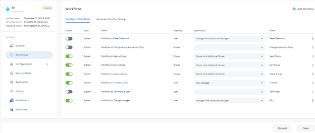
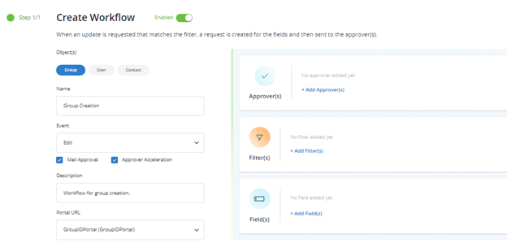
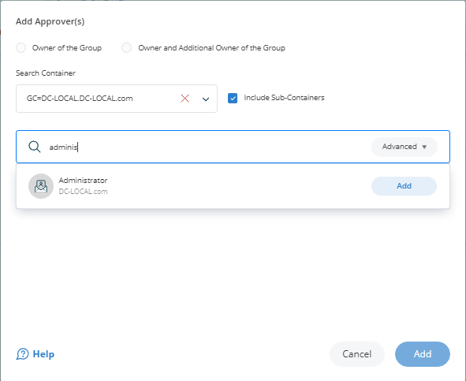

# How to Trigger a Workflow When a User Creates a Group

## Applies To

- Directory Manager 11

## Business Scenario

While delegating directory group creation to end users reduces Helpdesk load, it is always necessary to have some approval or monitoring process on the creation of new groups by end users. Is there a way to set up a workflow approval process for group creation?

## Solution

A workflow route can be defined for an identity store to track any new group creation and send out approval requests to concerned approvers. When a user creates a group via **Directory Manager Self-Service**, it will trigger the workflow and an approval request will be generated. In this way, group creation, which would subsequently take effect in Active Directory, is immediately brought to notice. A workflow route to control group creation involves:

- The object (group) the workflow applies to
- The event (create)
- The filter (security role) to specify a condition that must be met for the workflow to trigger
- The approver(s) to send the workflow request for approval

This implies that when a user meeting a certain workflow triggering condition creates a group via the self-service portal, a workflow request is sent to the approver(s). Changes are applied after the request is approved.

> **IMPORTANT:** You must configure notifications for an identity store for workflows to work.

## Steps

1. In the **Directory Manager Admin Center** portal, click the **Identity Stores** node.
2. Click on the **Triple Dot** button on the identity store and then click on **Edit** to open its properties.
3. Click the **Workflow** tab.

   

4. Click **Add Workflow**. A new window will appear.

   

5. Make sure the **Enabled** check box is selected for the workflow to apply.
6. In the **Object(s)** list, select *Group*.
7. Enter a name for the workflow in the **Name** box—for example, *Group Creation*.
8. In the **Events** drop-down list, select *Create*.
9. Select the **Enable mail approval** check box to enable the approver to approve or deny a workflow request from within the workflow email notification.
10. The **Enable approver acceleration** check box applies if approver acceleration has been enabled for the identity store. To exempt this workflow route from approver acceleration, clear this check box.
11. In the **Description** box, enter a brief description of the workflow. For example, *This workflow tracks the creation of groups by people from the User Security Role*.
12. In the **Portal URL** drop-down list, select a **Self-Service portal URL** to include in the workflow email notifications. The URL would redirect the recipients to the portal for acting on the respective request, such as approve or deny it.
13. Use the Filters area to specify a criterion that must be met for the workflow to trigger. In other words, when this filter criterion is not met, the workflow will not trigger. Do not apply a filter if you want the workflow to apply to all users.

    For example, if you apply the following filter:

    | Field | Condition | Value |
    |-------|-----------|-------|
    | Role  | Equals    | User  |

    It implies that when a user from the User security role creates a group via the Self-Service portal, the change isn’t effective immediately and this workflow gets triggered. When a person from any other security role creates a group, it won’t trigger the workflow.

14. The final step is to add a workflow approver:

    - Click **Add Approvers** in the **Approvers** area.

      

    - Select the user/group to approve the requests generated for this workflow. It is safer to specify an administrator/helpdesk as the approver rather than the group owners.
    - Click **Add**.

15. Click **OK** on the **Workflow Route** dialog box and then on the **Workflow** tab.

Now, any group creation made through **GroupID** by users from the User security role will trigger a workflow request.

## Reference

Admin Center — Workflows — Overview — v11.0

### Related Articles

- [Walkthrough Search Policy - Define Scope and Filter Results](https://docs.netwrix.com/docs/kb/directorymanager/walkthrough-search-policy-define-scope-and-filter-results).
- [How To Enforce Users to Create Groups in a Specific OU](https://docs.netwrix.com/docs/kb/directorymanager/how-to-enforce-users-to-create-groups-in-a-specific-ou).
- [How To Import Members to a Group Using Self-Service Import Wizard](https://docs.netwrix.com/docs/kb/directorymanager/how-to-import-members-to-a-group-using-self-service-import-wizard).
- [How To Add Message Approvers in Group Properties in Self-Service](https://docs.netwrix.com/docs/kb/directorymanager/how-to-add-message-approvers-in-group-properties-in-groupid-portal).
- [Best Practices for Controlling Changes to Group Membership](https://docs.netwrix.com/docs/kb/directorymanager/how-to-enforce-users-to-create-groups-in-a-specific-ou).
- [Best Practices for Preventing Accidental Data Leakage](https://docs.netwrix.com/docs/kb/directorymanager/best-practices-for-preventing-accidental-data-leakage).