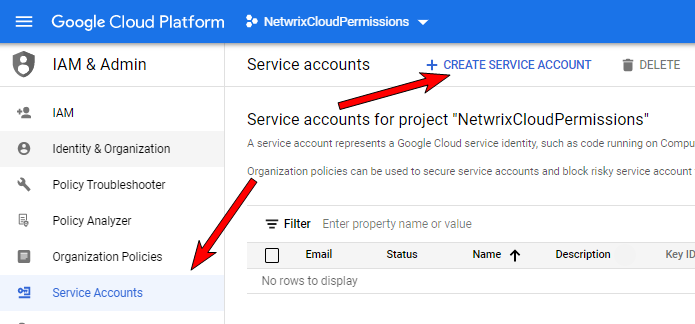
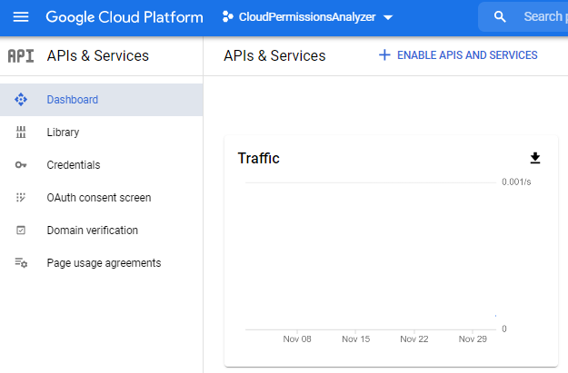

# How to configure Google Drive for Crawling

To authenticate to your Google Workspace (formerly known as G Suite) domain to perform crawling, Netwrix uses the OAuth 2.0 protocol. Data in individual and shared Drives will be accessed using the Google Drive API. You will need to create a service account and authorize it to access data on behalf of the user.

To configure Google Workspace for crawling, you should take the following steps (explained later in detail):

In the Google Cloud Platform web console

1. Create a new project.
2. Create a new service account.
3. Create a service account key (JSON, save a copy for the data source configuration).
4. Enable domain-wide delegation for the service account (write down the Client ID).
5. Enable the Google Drive API and the Admin SDK API.

In the Google Workspace Admin Console

1. Authorize service account to access the Google Drive API

NOTE: Google administrative interfaces tend to change over time, so if you cannot configure Google Drive for crawling using as described in this article, refer to the following guide for instructions on creating OAuth 2.0 service accounts: [Using OAuth 2.0 for Server to Server Applications](https://developers.google.com/identity/protocols/oauth2/service-account)

## Configure Google Workspace for crawling

### Step 1. Create a new project

1. Log in to the **Google Cloud Platform** web console: [https://console.cloud.google.com/](https://console.cloud.google.com/) as a Google Workspace administrator.
2. Click **Select a project**. In the **Select a project** dialog, click **New Project**:


3. In the dialog, specify the following:
   - Project name — *NetwrixPermissionAnalyzer*.
     - IMPORTANT! Provide a meaningful name for your project **without spaces**. Pay attention to the **Project ID** below and make sure it is identifiable for you since you cannot edit it later.
     
   - Organization — provide your organization's domain.
   - Location — provide your parent organization or folder.
4. Click **Create**.

### Step 2. Create a new service account

1. Click the **Google Cloud Platform** icon.
2. Navigate to **IAM & Admin** → **Service Accounts**.
3. Click **Create Service Account**:



4. In the **Create service account** dialog, provide the **Service account details**:
   - Service account name — new service account name. For example, *Netwrix Permission Analyzer Service Account*.
   - Service account ID — is set automatically.
   - Service account description — description if needed.
5. Click **Done**.

### Step 4. Create a service account key

1. On the **Service accounts** page, click the newly created service account.
2. In your account configuration wizard, go to the **Keys** tab.
3. Expand the **Add Key** list and select **Create new key** option.
4. In the **Create private key for [Service account name]** dialog, select `JSON` format.
5. The key will be downloaded automatically. Save the file to a known location as it will be required later.

NOTE: Your new public / private keypair is generated and downloaded to your machine. Store it securely. If you lose this keypair, you will need to generate a new one.

### Step 5. Delegate domain-wide authority to the service account

1. Go back to your service account **Details** tab.
2. Expand **Show Domain-Wide Delegation** and tick the **Enable G Suite Domain-wide Delegation** checkbox.
3. Provide a product name. For example, *NetwrixPermissionAnalyzer* (if you have already configured a service account, Google ignores this step).
4. Click **Save**.
5. Once completed, make sure that *Domain-wide delegation* is enabled for the account.
6. Click the **View Client ID** link.


7. Copy the Client ID, you will need it later.

### Step 6. Enable the Google Drive API and Admin SDK API

1. Click the **Google Cloud Platform** icon to go back to the home page.
2. Navigate to **APIs & Services** on the left, and select the **Dashboard** menu.
3. Click **Enable APIs and Services** at the top.



NOTE: If you already have any enabled APIs and/or Services in your project, skip this step and proceed with the instructions below.

4. Search for **Google Drive API** and click **Enable** (or **Manage** if you have this API in your project).
5. If you are going to process large amounts of data, Netwrix recommends you set quotas for this API (OPTIONAL):
   - On the **Google Drive API** page, select the **Quotas** menu on the left.
   - Expand queries by clicking the expand icon on the right.
   - Find the **Queries per 100 seconds per user** line and click the edit icon to edit.
   - Set the quota limit to `"10,000"` and save your changes.

   

6. IMPORTANT! Go back to **APIs & Services** → **Dashboard** and repeat steps 2 - 3 to enable the **Admin SDK API**. If you have this API in your project, skip this step, and proceed.

### Step 7. Configure domain-wide delegation to a new API client

1. Switch to the Google Workspace Admin Console: [https://admin.google.com/](https://admin.google.com/)
2. Navigate to **Security** → **API Controls** → **Domain-wide delegation**.
3. On the **API controls** page, click **Manage domain-wide delegation** at the bottom.
4. Click **Add new** to add a new API client.
5. In the **Add a new client ID** dialog, provide the ID you copied earlier (see the corresponding step).
6. Then, specify necessary scopes in the **OAuth scopes** field. These can be:

```text
https://www.googleapis.com/auth/drive.readonly,
https://www.googleapis.com/auth/admin.directory.domain.readonly,
https://www.googleapis.com/auth/admin.directory.user.readonly,
https://www.googleapis.com/auth/admin.directory.group.readonly
```

NOTE: For your convenience, the scopes are listed as comma-delimited. Google splits them accordingly, so you can paste the whole list to a field right from this article.

7. Click **Authorize**. Wait for Google to recognize the scopes and then click **Authorize** again to apply.

## What is next:

1. Log in to Netwrix Cloud Permission Analyzer.
2. Read the **Get Started** section. Click **Continue**.
3. In the Google Drive connection settings, provide the Google Drive administrator account under which you logged in to the **Google Cloud Platform** web console.
4. Click **Import JSON file with Google service account settings** and select the file you downloaded on [step 4]().
5. IMPORTANT! **Configure scope** – add your shared and/or personal Google Drives to the list. You can use a wildcard (`*`) if you want to crawl all drives in your Google Drive.

NOTE: By default, Netwrix Cloud Permission Analyzer collects Google Drive data once a day. If you modify your Google Drive configuration and save your changes, the product initiates data collection automatically.
