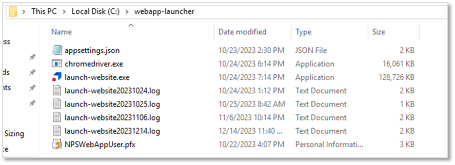
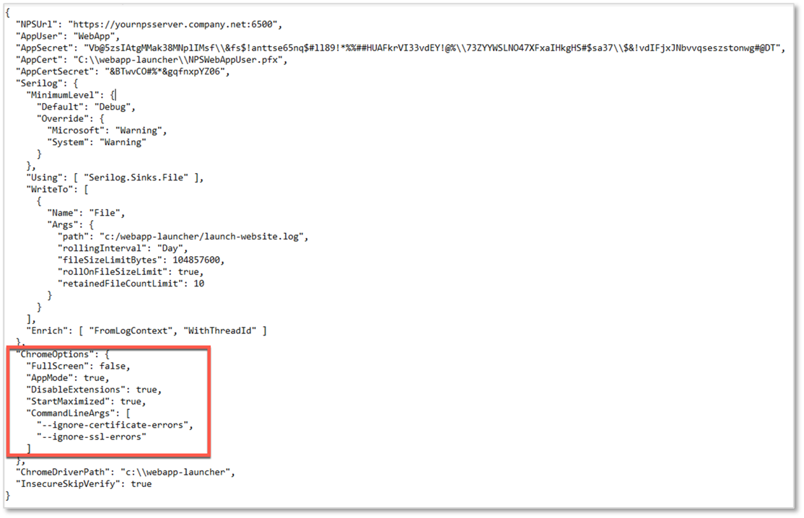
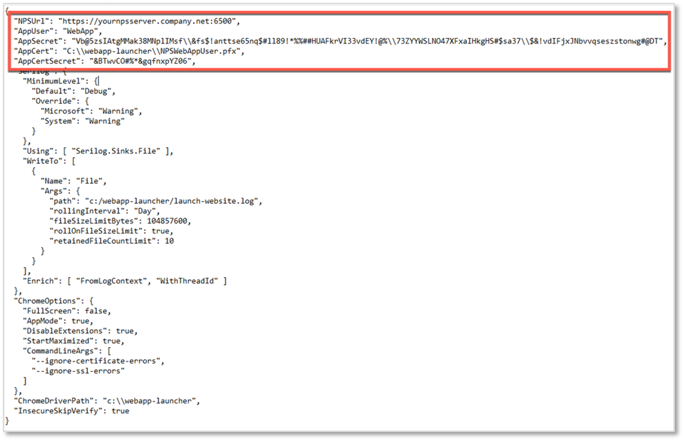
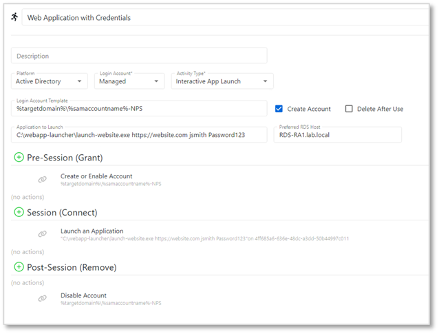
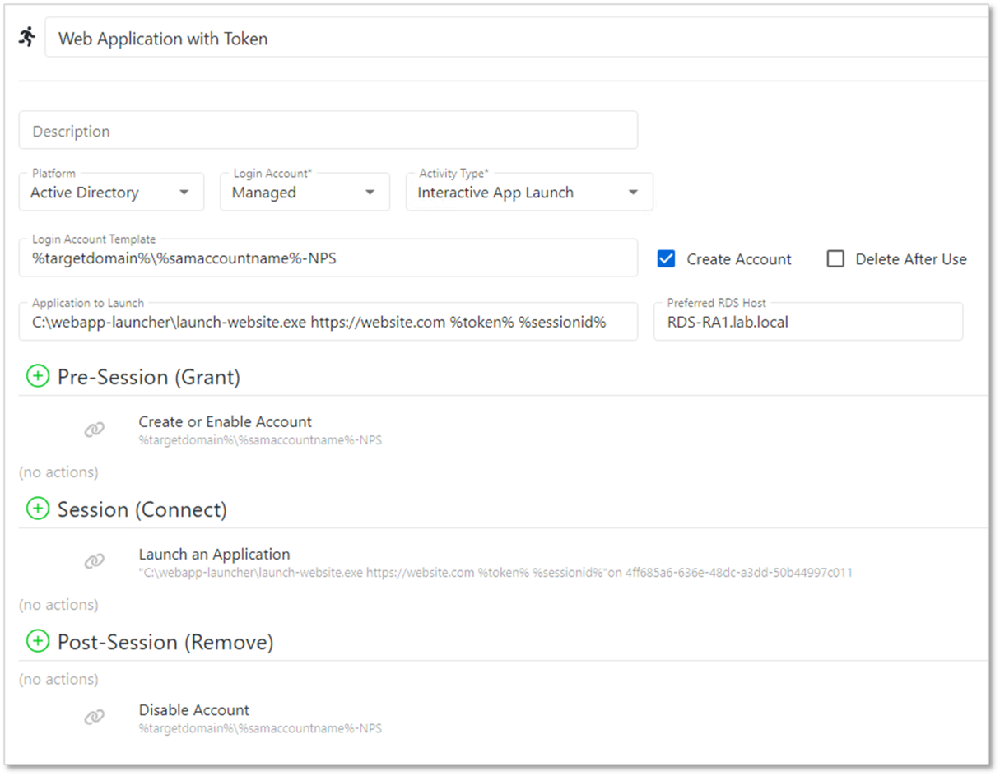
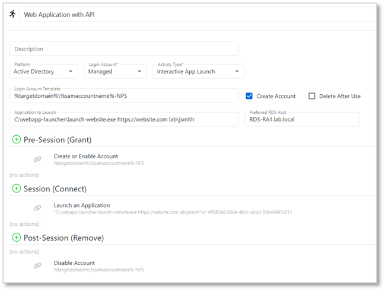

# Configuring the Netwrix Privilege Secure RDS Web App Launcher

## Introduction
The Web App Launcher for Netwrix Privilege Secure is an application used to launch websites as RemoteApps using Microsoft Remote Desktop Services (RDS).

See this article) for information about publishing RemoteApps.

## Deployment
The Web App Launcher can be downloaded from [this link](https://dl.netwrix.com/additional/WebAppLauncher.zip).

On the RDS server, extract the files to a directory of your choosing. For the examples in this article, `C:\webapp-launcher\` will be used.



## Configuration

### Runtime Settings
There are configurable runtime settings that you can apply to the Web App Launcher.

- Full Screen - runs the website in full screen mode
- App Mode - runs the browser with no tabs or menu controls
- Disable Extensions - prevent the browser from running extensions
- Start Maximized - runs the browser maximized
- Command Line Arguments - allows certificate and SSL errors to be ignored when using the Web Launcher

In order to configure these settings, open `appsettings.json` in your Web App Launcher directory. The `ChromeOptions` section contains the above settings. Change the values as required, and save the file.



Note that these settings affect all websites launched from this Web App Launcher. If it is necessary to have multiple sets of settings, create another Web App Launcher directory with a different `appsettings.json` configuration, and use the appropriate one in NPS.

### API Settings
In order to use the Web App Launcher, an Application User must be created in NPS. Once this is done, supply the username and API Key into the `AppUser` and `AppSecret` fields, respectively. The certificate should be placed in the Web App Launcher directory, with the directory indicated in the `AppCert` field as indicated:

:::warning Any backslashes (\) in the app secret must be escaped with a preceeding backslash (\\):::



### Web App Launcher Directories
Ensure that the indicated paths correspond to the chosen Web App Launcher directory.


## Launch Options and Examples

### 1. Launching websites and passing in username and password via command line
In this mode, username and password are passed as parameters on the command line. It is important to remember that in a production setting, any command line parameters can be viewed by other users of the RDS host with access to Task Manager. We recommend that this launch option should be used for testing or non-production use.

Usage:

```
launch-website.exe [url] [username] [password]
```

Example:

```
launch-website.exe https://website.com jsmith Password123
```



Note that the login account in this example connects to the RDS session running the web app launcher as a remote app. The web app launcher will launch the website under the context of the user and password supplied as command line arguments.

### 2. Launching websites by passing in an NPS token and session ID (NPS 4.1 and above)
In this mode, token and session ID are passed to the launcher. The launcher will use this information to dynamically pull the username and password from the NPS Proxy and pass it to the website.

Usage:

```
launch-website.exe [url] [token] [sessionid]
```

Example:

```
launch-website.exe https://website.com %token% %sessionid%
```



Note that the login account in this example both connects to the RDS session running the web app launcher as a remote app, and is used as the credential to be passed to the website.

### 3. Launching websites by specifying a username, with the password pulled via the NPS API
In this mode, a username is passed on the command line to the launcher. The launcher will call the NPS API to get the password stored in the NPS vault and pass it to the website.

The username value can be in the following formats:
- `Domain\username` – if the website account is a managed account in the domain
- `Resource\username` – if the website account is a managed account on a Resource
- `Website Name\username` – if the website account is stored in the Users tab of a website Resource

Usage:

```
launch-website.exe [url] [username]
```

Example:

```
launch-website.exe https://website.com lab\jsmith
```



Note that the login account in this example connects to the RDS session running the web app launcher as a remote app. The web app launcher will launch the website under the context of the username provided on the command line. The web app launcher will call the API to get the managed password of the user, and will enter it into the password field of the website.
