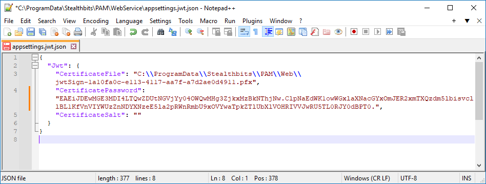

# How to Create a Service Mesh Between App Servers

## Overview

This article outlines the steps to configure a service mesh in Netwrix Privilege Secure for Access Management. Follow these instructions to ensure proper setup and high availability.

- If you have two application servers with internal PostgreSQL on each, you must configure high availability (HA) before configuring a service mesh. For additional information on the HA setup, see Configure and Upgrade Netwrix Privilege Secure in High Availability Mode and Using Remote Services Configurations: [Configuring and Upgrading in High Availability Mode and Using Remote Services Configurations](/docs/kb/privilegesecure/configuring-and-upgrading-in-high-availability-mode-and-using-remote-services-configurations.md)
- In both PostgreSQL and SQL Server deployments, you must complete the key exchange in your environment before configuring a service mesh. For additional information on the key exchange setup, see [How to Configure Encryption Keys in Multiple NPS Server Environments](/docs/kb/privilegesecure/how-to-configure-encryption-keys-in-multiple-nps-server-environments.md)

> **IMPORTANT:** Multi-factor authentication should be disabled for the Netwrix Privilege Secure Administrator account, if used. While this will be indicated by an error message when running `sbpam-proxy.exe`, the error will not indicate the missing 2FA or the need to disable it prior to running.

For additional information on used protocols and ports, see [Port, Firewall, and Datacenter Requirements](https://docs.netwrix.com/docs/privilegesecurediscovery/requirements/portsandfirewalls#firewall-rules)

## Instructions

> **IMPORTANT:** When the **C** drive is referenced, these configuration files are on the C drive. If the application was installed to a dedicated drive, replace **X** with your appropriate application drive letter for steps with this example.

1. On the primary Privilege Secure server, locate the Web directory. Default path:
   ```text
   C:\ProgramData\Stealthbits\PAM\Web\
   ```
   Copy the entire contents of this directory to the corresponding path on the secondary server.

2. On the primary server, locate the `appsettings.jwt.json` file. Default path:
   ```text
   C:\ProgramData\Stealthbits\PAM\WebService\appsettings.jwt.json
   ```
   In the primary `.json` file, locate the `Jwt` node. Copy it to the `appsettings.jwt.json` file on the secondary server.

   > **NOTE:** The `Jwt` node consists of the contents found within the `{}` braces following `Jwt`. Typically, the `Jwt` node will be the only node defined in the file. The entire file can be copied from one server to another, as in the following example.

   

3. Copy the file referenced in `appsettings.jwt.json` from the primary to the secondary server.

4. On the secondary server, open **IIS Manager** and restart the web server.

5. On the secondary server, restart all Privilege Secure services.

6. Start Privilege Secure on the secondary server. Log in, click your **User Name** in the upper-right corner, and select **Settings**. Click **Register Services**.

7. Review the `sbpam_node.json` file on both the primary and secondary servers. Default path:
   ```text
   C:\ProgramData\Stealthbits\PAM\ProxyService\sbpam_node.json
   ```
   The default `advertise` value is blank. In the `advertise` value, specify the IP address, FQDN, and NetBIOS name of the server where the `sbpam_node.json` file is located. Example:
   ```json
   {
       "advertise": [
           "192.168.1.123",
           "NPS-PRI.test.lab",
           "NPS-PRI"
       ],
       "tags": []
   }
   ```

8. On both servers, remove the file `sbpam-node.crt`. Default path:
   ```text
   C:\ProgramData\Stealthbits\PAM\tls\certs\sbpam-node.crt
   ```

   > **NOTE:** The `sbpam-node.crt` file may reappear immediately following deletion—this behavior is expected.

9. On the primary server, run the following command in an elevated Command Prompt to obtain the CA hash:
   ```text
   "X:\Program Files\Stealthbits\PAM\ProxyService\sbpam-proxy.exe" register ca-hash
   ```
   Copy the returned hash value and use it in the following step.

10. On the secondary server, run the following command in an elevated Command Prompt to register the server as a cluster on the primary server:
    ```text
    "X:\Program Files\Stealthbits\PAM\ProxyService\sbpam-proxy.exe" register -s <%primary.address%> -u <%admin%> -P Cluster -H <%HASH%>
    ```

    > **IMPORTANT:** Replace the placeholders with corresponding values. The `%admin%` value should represent the Privilege Secure administrator account in the `domain\samaccountname` format. The administrator account used must **temporarily** have MFA disabled in the **Users & Groups** section of the Web Interface.

    The output should resemble the following structure:
    ```text
    Registration successful (remotes: [192.168.1.123:6523], routes: [192.168.1.123:6524])
    ```

11. Restart all Privilege Secure services on the secondary node using PowerShell:
    ```powershell
    Restart-Service SbPAM* -Force
    ```
    Then restart IIS:
    ```powershell
    Restart-Service w3svc
    ```

## Enabling Recording Replication (Optional)

To enable replication of session recordings (`.webm` files for web sessions, `.iolog` files for non-web sessions), perform the following steps:

> **IMPORTANT:** This must be done on both servers. The `sbpam_iolog.json` file is generated on the C drive regardless of the location from which the command is run.

1. Generate the **iolog config** by opening a command prompt, navigating to `X:\Program Files\Stealthbits\PAM\ProxyService`, and running:
   ```text
   sbpam-proxy.exe cfg -c sbpam_iolog
   ```

2. Open the `sbpam_iolog.json` file that has just been created and ensure that a **replicas** setting exists and is set to **2**. Ensure that the resulting file is properly comma-separated. Then, save the `sbpam_iolog.json` file.
   ```json
   "replicas": 2
   ```

3. Once the file is saved, restart the proxy service and recording replication should occur.

For detailed steps on moving the recording locations, see How to Change the Path Where Session Recordings Are Stored: [How to Change the Path Where Session Recordings Are Stored](/docs/kb/privilegesecure/how-to-change-the-path-where-session-recordings-are-stored.md)

## Related Articles

- [Configuring and Upgrading in High Availability Mode and Using Remote Services Configurations](/docs/kb/privilegesecure/configuring-and-upgrading-in-high-availability-mode-and-using-remote-services-configurations.md)
- [How to Configure Encryption Keys in Multiple NPS Server Environments](/docs/kb/privilegesecure/how-to-configure-encryption-keys-in-multiple-nps-server-environments.md)
- [Port, Firewall, and Datacenter Requirements](https://docs.netwrix.com/docs/privilegesecurediscovery/requirements/portsandfirewalls#firewall-rules)- [How to Change the Path Where Session Recordings Are Stored](/docs/kb/privilegesecure/how-to-change-the-path-where-session-recordings-are-stored.md)
